# OpenClaw 核心算法流程图集

> **版本**: 2026.4.27  
> **日期**: 2026-05-27  
> **说明**: 本文档从技术设计说明书中提取核心算法部分，以 Mermaid 流程图形式详细展示各算法的决策逻辑与执行流程。

---

## 目录

1. [整体调度主流程（双路径）](#1-整体调度主流程双路径)
2. [自适应策略分类决策树](#2-自适应策略分类决策树)
3. [策略路由详细流程](#3-策略路由详细流程)
4. [Fallback 降级机制](#4-fallback-降级机制)
5. [EMA 权重更新与熔断机制](#5-ema-权重更新与熔断机制)
6. [Hook 管道执行流程](#6-hook-管道执行流程)
7. [Bridge Gateway 路由映射流程](#7-bridge-gateway-路由映射流程)
8. [负载均衡与端点选择](#8-负载均衡与端点选择)
9. [Bridge 自适应路由流程](#9-bridge-自适应路由流程)
10. [端点状态 EMA 更新算法](#10-端点状态-ema-更新算法)

---

## 1. 整体调度主流程（双路径）

### 1.1 主调度入口流程

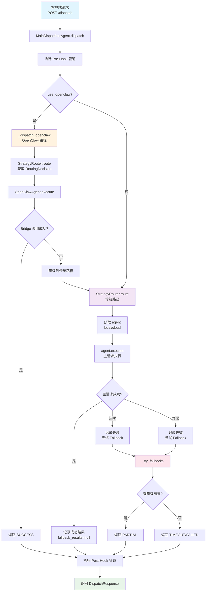

### 1.2 双路径架构总览

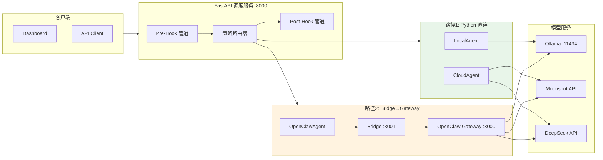

---

## 2. 自适应策略分类决策树

### 2.1 请求分类流程（_classify_request）

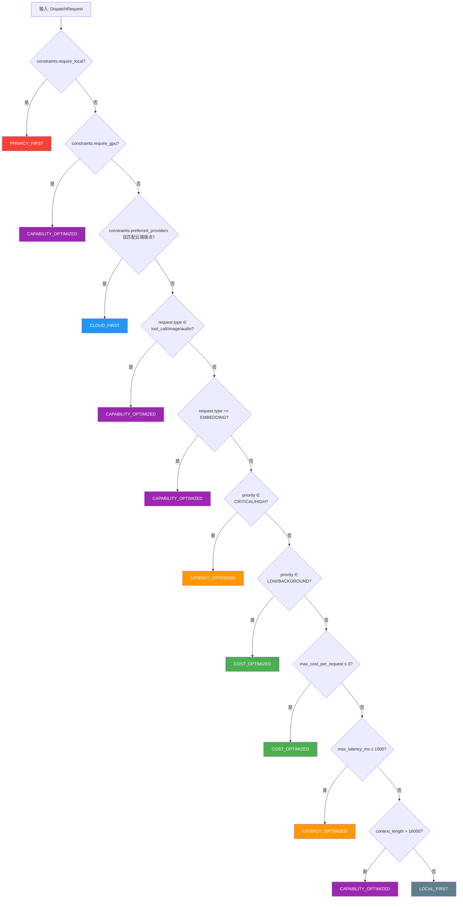

### 2.2 策略选择与 Agent 类型确定（_select_strategy + _determine_agent_type）

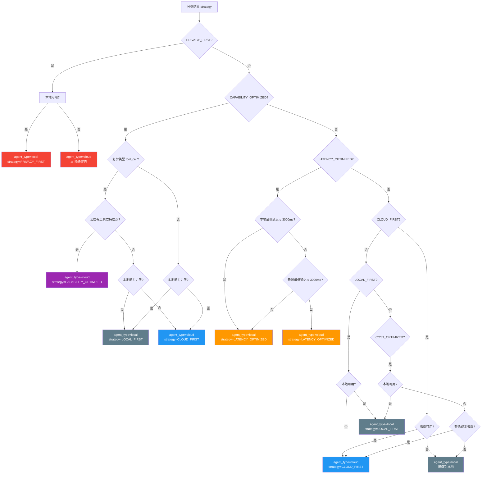

---

## 3. 策略路由详细流程

### 3.1 StrategyRouter.route 主入口

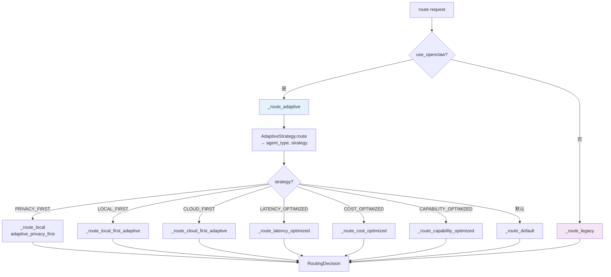

### 3.2 LOCAL_FIRST 策略路由

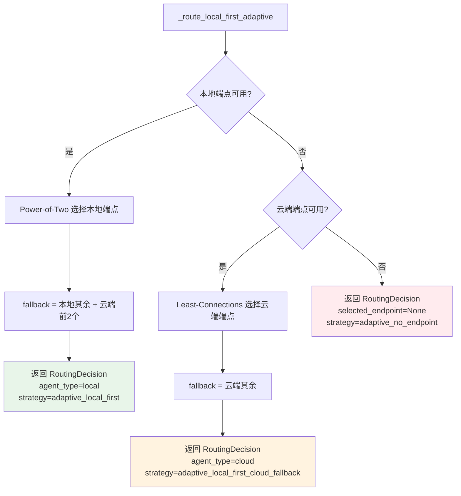

### 3.3 CLOUD_FIRST 策略路由

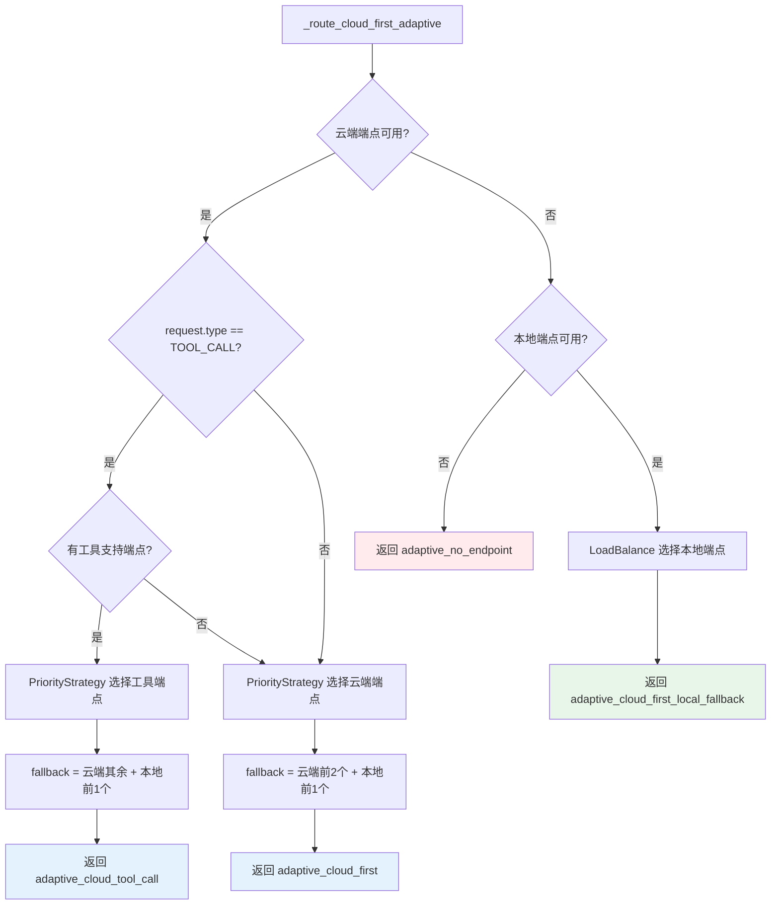

### 3.4 LATENCY_OPTIMIZED 策略路由

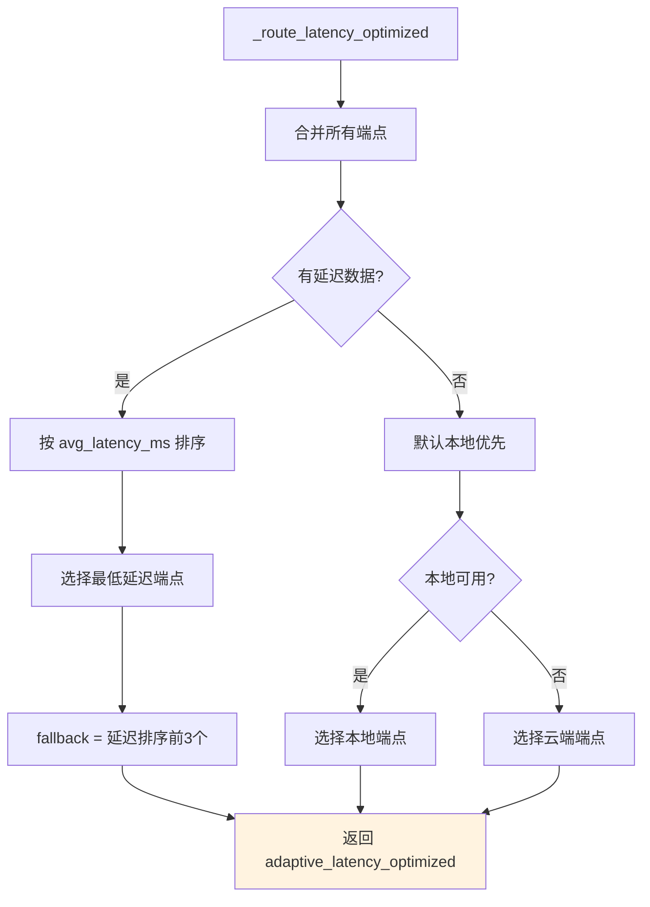

### 3.5 COST_OPTIMIZED 策略路由

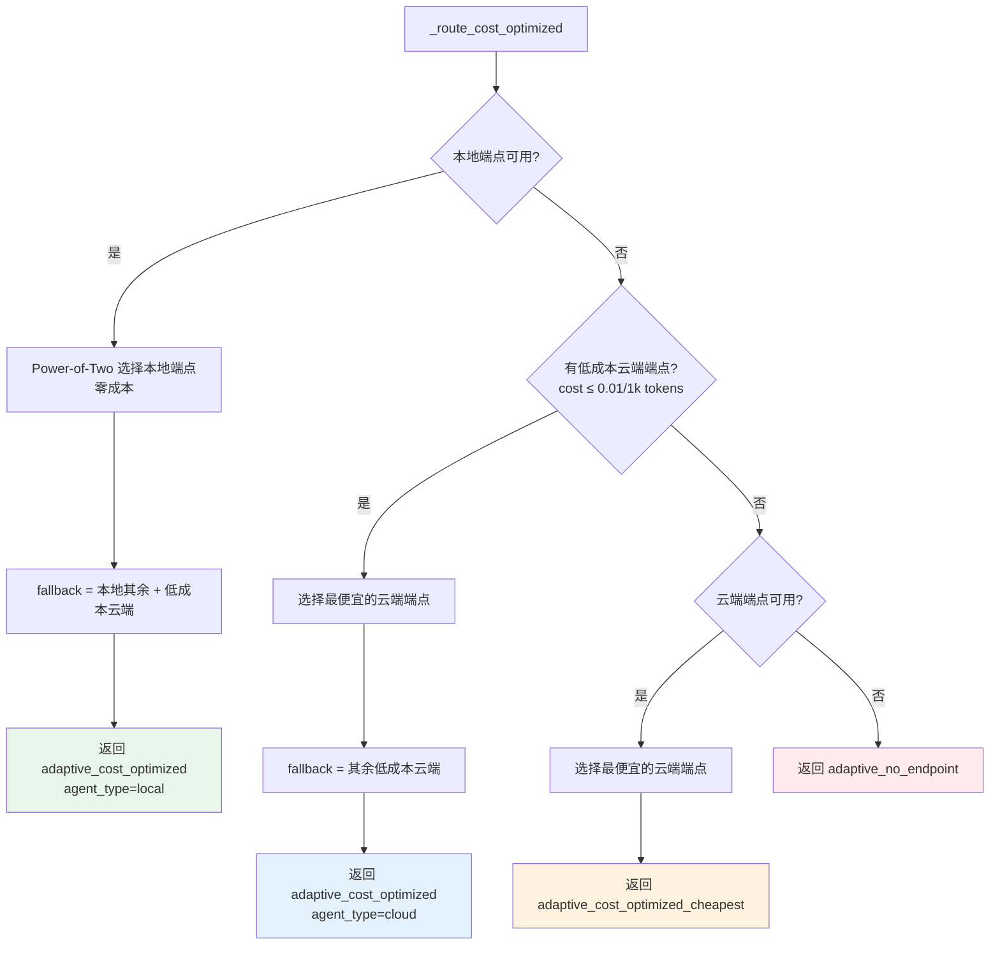

### 3.6 CAPABILITY_OPTIMIZED 策略路由

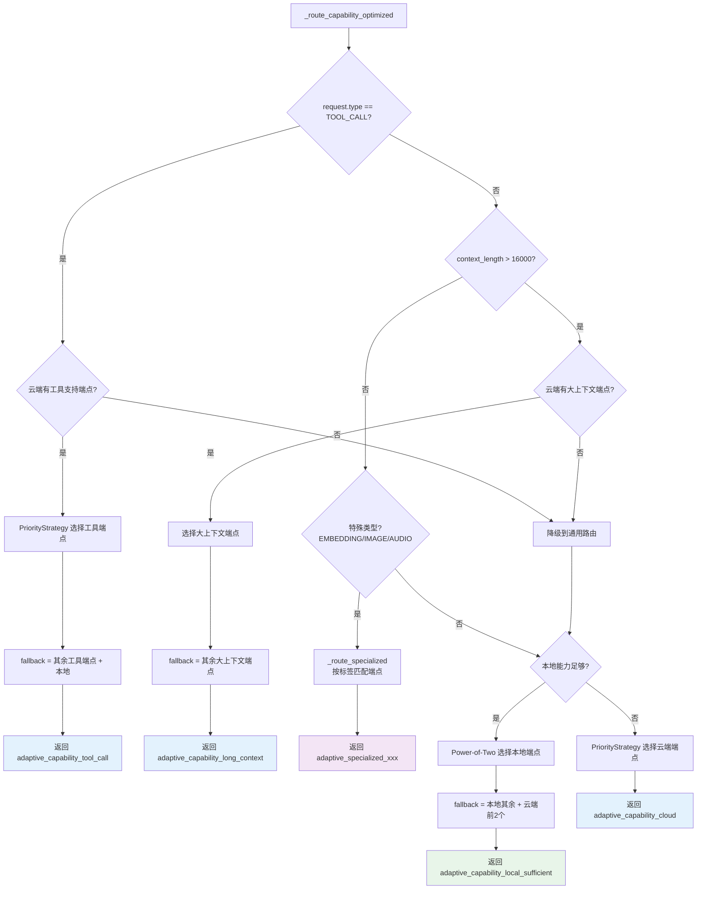

### 3.7 PRIVACY_FIRST 策略路由

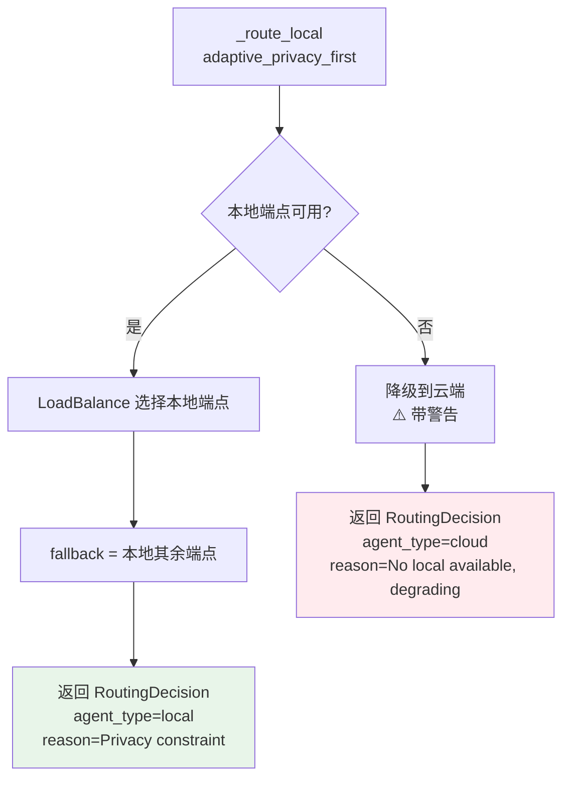

---

## 4. Fallback 降级机制

### 4.1 主请求失败后的 Fallback 流程

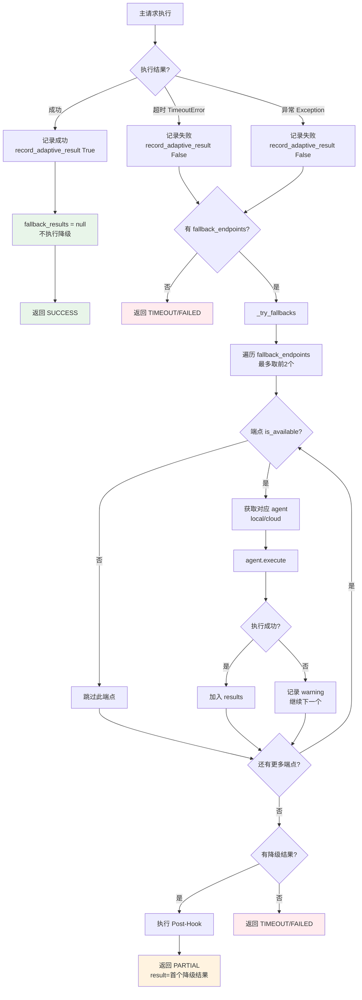

### 4.2 Bridge 端 Fallback 流程

```mermaid
flowchart TD
    START[dispatchViaOpenClaw] --> A[adaptiveRoute → routing]
    A --> B{selected_endpoint?}
    B -->|无| C[返回 failed<br/>NO_ENDPOINT]
    B -->|有| D[callModelApi<br/>主端点请求]
    
    D --> E{成功?}
    E -->|是| F[返回 success<br/>fallback_results=null]
    E -->|否| G{有 fallback_endpoints?}
    
    G -->|否| H[返回 failed<br/>ALL_ENDPOINTS_FAILED]
    G -->|是| I[遍历 fallback[:2]]
    
    I --> J[callModelApi<br/>降级端点]
    J --> K{成功?}
    K -->|是| L[返回 success<br/>标记 fallback]
    K -->|否| M{还有降级端点?}
    M -->|是| I
    M -->|否| H

    style F fill:#e8f5e9
    style L fill:#fff3e0
    style C fill:#ffebee
    style H fill:#ffebee
```

---

## 5. EMA 权重更新与熔断机制

### 5.1 自适应权重更新流程（record_result → _update_adaptive_weights）

```mermaid
flowchart TD
    START[record_result<br/>model_type, success, latency_ms] --> D{model_type?}
    
    D -->|local| L{success?}
    L -->|是| L1{latency ≤ threshold?}
    L1 -->|是| L2["local_weight = min(1.0, lw + 0.1)<br/>cloud_weight = max(0.0, cw - 0.1)"]
    L1 -->|否| L3[仅记录延迟<br/>不调整权重]
    L -->|否| L4["local_weight = max(0.1, lw - 0.2)<br/>cloud_weight = min(0.9, cw + 0.2)<br/>_local_fail_streak++"]
    
    D -->|cloud| C{success?}
    C -->|是| C1["cloud_weight = min(0.9, cw + 0.05)<br/>local_weight = max(0.1, lw - 0.05)"]
    C -->|否| C2["cloud_weight = max(0.1, cw - 0.1)<br/>local_weight = min(0.9, lw + 0.1)<br/>_cloud_fail_streak++"]
    
    L2 --> W[权重保护<br/>范围 [0.1, 0.9]]
    L3 --> W
    L4 --> W
    C1 --> W
    C2 --> W
    
    W --> CB{检查熔断条件}
    CB --> CBA{_local_fail_streak ≥ 3?}
    CBA -->|是| CBB[强制切换到 CLOUD_FIRST]
    CBA -->|否| CBC{_cloud_fail_streak ≥ 3?}
    CBC -->|是| CBD[强制切换到 LOCAL_FIRST]
    CBC -->|否| DONE[更新完成]
    CBB --> DONE
    CBD --> DONE

    style L2 fill:#e8f5e9
    style L4 fill:#ffebee
    style C1 fill:#e3f2fd
    style C2 fill:#ffebee
    style CBB fill:#ff9800
    style CBD fill:#ff9800
```

### 5.2 熔断与故障切换状态机

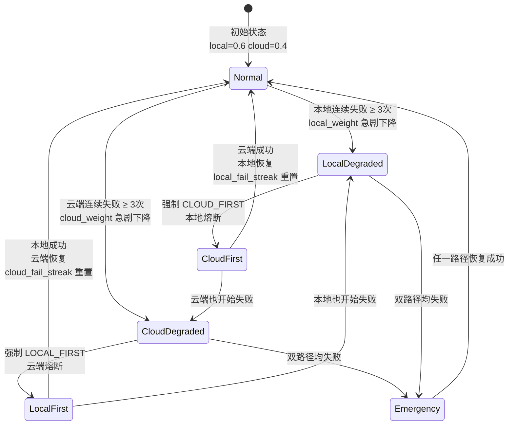

### 5.3 EMA 更新参数对比

```mermaid
graph LR
    subgraph 延迟更新 α=0.3
        L1[旧值 × 0.7] --> L2[+ 新值 × 0.3]
        L2 --> L3[快速响应延迟变化]
    end
    
    subgraph 成功率更新 α=0.05
        S1[旧值 × 0.95] --> S2[+ 新值 × 0.05]
        S2 --> S3[长期平滑观察]
    end
    
    subgraph 权重更新 α=0.1
        W1[旧值 ± 0.1~0.2] --> W2[适度调整]
        W2 --> W3[避免震荡]
    end

    style L3 fill:#fff3e0
    style S3 fill:#e3f2fd
    style W3 fill:#e8f5e9
```

---

## 6. Hook 管道执行流程

### 6.1 Pre-Hook 管道执行

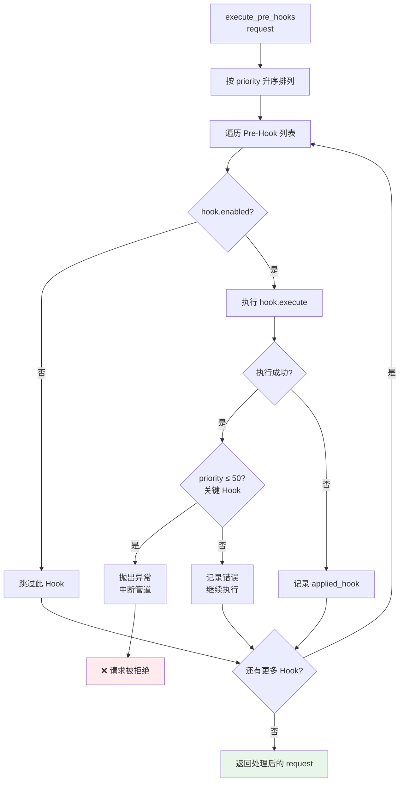

### 6.2 Pre-Hook 执行顺序与关键性

```mermaid
flowchart LR
    subgraph 关键 Hook priority ≤ 50
        H1["🔒 RateLimitHook<br/>priority=5<br/>失败→中断"]
        H2["✅ RequestValidationHook<br/>priority=10<br/>失败→中断"]
        H3["🔧 ConstraintEnrichmentHook<br/>priority=20<br/>失败→中断"]
    end
    
    subgraph 非关键 Hook priority > 50
        H4["📝 RequestLoggingHook<br/>priority=90<br/>失败→继续"]
    end
    
    H1 --> H2 --> H3 --> H4

    style H1 fill:#f44336,color:#fff
    style H2 fill:#ff9800,color:#fff
    style H3 fill:#2196f3,color:#fff
    style H4 fill:#9e9e9e,color:#fff
```

### 6.3 Post-Hook 执行顺序

```mermaid
flowchart LR
    subgraph 关键 Hook priority ≤ 50
        H1["🔒 ResponseSanitizationHook<br/>priority=10<br/>脱敏处理"]
        H2["💰 CostCalculationHook<br/>priority=20<br/>成本估算"]
        H3["🔄 RetryDecisionHook<br/>priority=30<br/>重试决策"]
    end
    
    subgraph 非关键 Hook priority > 50
        H4["📝 ResponseLoggingHook<br/>priority=90<br/>响应日志"]
    end
    
    H1 --> H2 --> H3 --> H4

    style H1 fill:#f44336,color:#fff
    style H2 fill:#ff9800,color:#fff
    style H3 fill:#2196f3,color:#fff
    style H4 fill:#9e9e9e,color:#fff
```

### 6.4 RateLimitHook 滑动窗口算法

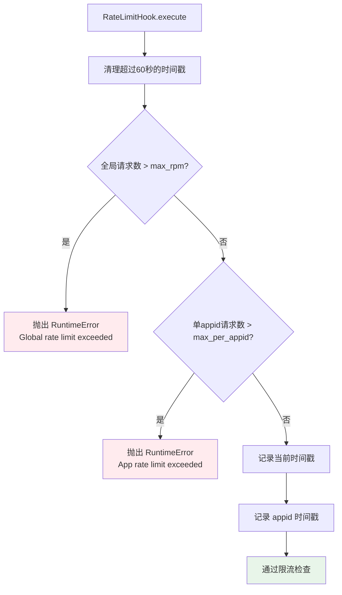

### 6.5 RetryDecisionHook 重试决策

```mermaid
flowchart TD
    START[RetryDecisionHook.execute] --> A{finish_reason == error<br/>或 output 为空?}
    A -->|否| B[清除重试计数<br/>返回 result]
    A -->|是| C[获取 retry_count]
    C --> D{retry_count < max_retries?<br/>默认2}
    D -->|是| E[标记重试<br/>retry_count++]
    D -->|否| F[超过最大重试<br/>清除计数]
    E --> G[返回 result<br/>标记需重试]
    F --> G

    style B fill:#e8f5e9
    style G fill:#fff3e0
```

---

## 7. Bridge Gateway 路由映射流程

### 7.1 callModelApi 核心流程

```mermaid
flowchart TD
    START[callModelApi<br/>endpoint, request] --> A[endpoint.currentLoad++]
    A --> B[构建 messages 数组]
    B --> C{USE_OPENCLAW_GATEWAY?}
    
    C -->|是| D1["model = resolveGatewayModel(endpoint)<br/>如 openclaw/local-dispatcher"]
    C -->|否| D2["model = endpoint.modelId<br/>如 qwen2.5:3b"]
    
    D1 --> E1["targetUrl = GATEWAY_URL/v1/chat/completions<br/>timeout=120s"]
    D2 --> E2["targetUrl = baseUrl/chat/completions<br/>timeout=30s"]
    
    E1 --> F[fetch POST targetUrl]
    E2 --> F
    
    F --> G{响应成功?}
    G -->|是| H[解析响应<br/>计算成本]
    H --> I[updateEndpointState<br/>latency, success=true]
    I --> J[endpoint.currentLoad--]
    J --> K[返回 ModelResult<br/>routed_via_gateway=true/false]
    
    G -->|否| L[updateEndpointState<br/>success=false]
    L --> M[endpoint.currentLoad--]
    M --> N[抛出异常]

    style K fill:#e8f5e9
    style N fill:#ffebee
```

### 7.2 Gateway 路由映射关系

```mermaid
flowchart LR
    subgraph 端点ID
        E1["ollama/qwen2.5:3b"]
        E2["moonshot/kimi-k2.6"]
        E3["deepseek/deepseek-chat"]
        E4["未知端点"]
    end
    
    subgraph Agent ID
        A1["openclaw/local-dispatcher"]
        A2["openclaw/cloud-dispatcher"]
        A3["openclaw/code-executor"]
        A4["openclaw (默认)"]
    end
    
    subgraph Gateway 路由
        G1["→ Agent 查找 openclaw.json"]
        G2["→ primary model"]
        G3["→ 执行模型调用"]
        G4["→ 失败时尝试 fallbacks"]
    end
    
    E1 --> A1
    E2 --> A2
    E3 --> A3
    E4 --> A4
    
    A1 --> G1
    A2 --> G1
    A3 --> G1
    A4 --> G1
    G1 --> G2 --> G3 --> G4

    style E1 fill:#e8f5e9
    style E2 fill:#e3f2fd
    style E3 fill:#f3e5f5
    style E4 fill:#eeeeee
```

### 7.3 handleOpenClawAgentMessage 流程

```mermaid
flowchart TD
    START[handleOpenClawAgentMessage<br/>agent_id, prompt] --> A[查找 openclaw.json<br/>中的 agent 配置]
    A --> B{agent 存在?}
    B -->|否| C[返回 error<br/>Agent not found]
    B -->|是| D[获取 agent.primary model]
    D --> E{model 在 CATALOG 中?}
    E -->|否| F[返回 error<br/>Model not found]
    E -->|是| G[callModelApi<br/>主模型]
    G --> H{成功且 finish_reason ≠ error?}
    H -->|是| I[返回 success<br/>fallback=false]
    H -->|否| J{agent 有 fallbacks?}
    J -->|否| K[返回成功/失败结果]
    J -->|是| L[遍历 fallbacks]
    L --> M[callModelApi<br/>降级模型]
    M --> N{成功?}
    N -->|是| O[返回 success<br/>fallback=true]
    N -->|否| P{还有更多 fallback?}
    P -->|是| L
    P -->|否| K

    style I fill:#e8f5e9
    style O fill:#fff3e0
    style C fill:#ffebee
    style F fill:#ffebee
```

---

## 8. 负载均衡与端点选择

### 8.1 Power-of-Two 负载均衡算法

```mermaid
flowchart TD
    START[Power-of-Two 选择] --> A[从候选列表中<br/>随机选取2个端点]
    A --> B{候选数 ≥ 2?}
    B -->|是| C[比较 current_load]
    B -->|仅1个| D[直接返回该端点]
    B -->|无| E[返回 None]
    C --> F[返回负载较低者]

    style F fill:#e8f5e9
    style D fill:#e8f5e9
    style E fill:#ffebee
```

### 8.2 PriorityStrategy 评分选择算法

```mermaid
flowchart TD
    START[PriorityStrategy.select<br/>request, candidates] --> A[初始化 score=100.0<br/>对每个候选端点]
    
    A --> B["score -= (priority-1) × 15.0<br/>优先级扣分"]
    B --> C["score -= load_factor × 20.0<br/>负载扣分"]
    C --> D["score += success_rate × 10.0<br/>成功率加分"]
    D --> E{延迟在约束内?}
    E -->|是| F["score += (1-latency_ratio) × 15.0<br/>延迟加分"]
    E -->|否| G["score -= 50.0<br/>延迟惩罚"]
    
    F --> H{约束匹配加分}
    G --> H
    
    H --> H1{require_local + 本地?}
    H1 -->|是| I1["+30.0"]
    H1 -->|否| H2{require_local + 云端?}
    H2 -->|是| I2["-100.0"]
    H2 -->|否| H3
    
    H3{CRITICAL + 本地低延迟?}
    H3 -->|是| I3["+20.0"]
    H3 -->|否| H4{model_hint 匹配?}
    H4 -->|名称匹配| I4["+25.0"]
    H4 -->|模型ID匹配| I5["+20.0"]
    H4 -->|否| H5{preferred_providers 匹配?}
    H5 -->|是| I6["+20.0"]
    H5 -->|否| H6{excluded_providers 匹配?}
    H6 -->|是| I7["-100.0"]
    H6 -->|否| J[最终评分]
    
    I1 --> J
    I2 --> J
    I3 --> J
    I4 --> J
    I5 --> J
    I6 --> J
    I7 --> J
    
    J --> K[按 score 降序排序]
    K --> L[返回最高分端点]

    style L fill:#e8f5e9
```

### 8.3 五种负载均衡算法对比

```mermaid
graph TD
    subgraph ROUND_ROBIN
        R1[轮询分配] --> R2[按顺序依次选择]
    end
    
    subgraph WEIGHTED_RANDOM
        W1[加权随机] --> W2[按 weight 概率分配]
    end
    
    subgraph LEAST_CONNECTIONS
        L1[最少连接] --> L2[选 current_load 最低]
    end
    
    subgraph LEAST_LATENCY
        LE1[最低延迟] --> LE2[选 avg_latency_ms 最低]
    end
    
    subgraph POWER_OF_TWO
        P1[二选一] --> P2[随机选2个取负载低的]
    end

    style R2 fill:#e8f5e9
    style W2 fill:#e3f2fd
    style L2 fill:#fff3e0
    style LE2 fill:#f3e5f5
    style P2 fill:#fce4ec
```

---

## 9. Bridge 自适应路由流程

### 9.1 Bridge adaptiveRoute 完整决策流程

```mermaid
flowchart TD
    START[adaptiveRoute<br/>request] --> A{constraints.require_local?}
    
    A -->|是| B[selectBestModel<br/>本地端点]
    B --> B1[返回 adaptive_local_required]
    
    A -->|否| C{constraints.preferred_providers<br/>有匹配?}
    C -->|是| D[selectBestModel<br/>匹配供应商的端点]
    D --> D1[返回 adaptive_preferred_provider]
    
    C -->|否| E{priority ≤ 2<br/>且 localFirst?}
    E -->|是| F{本地端点可用?}
    F -->|是| G[返回 adaptive_priority_local_first]
    F -->|否| H[继续后续判断]
    
    E -->|否| I{复杂类型?<br/>tool_call/image/audio}
    I -->|是 且 preferCloudForComplex| J{云端端点可用?}
    J -->|是| K[返回 adaptive_complex_cloud_first]
    J -->|否| H
    
    I -->|否| L{localFirst?}
    L -->|是| M{本地端点可用?}
    M -->|是| N{本地延迟 ≤ 阈值?}
    N -->|是| O[返回 adaptive_local_first<br/>低延迟零成本]
    N -->|否| P[返回 adaptive_local_first<br/>默认选择]
    M -->|否| Q{云端端点可用?}
    Q -->|是| R[返回 adaptive_cloud_only]
    Q -->|否| S[返回 adaptive_no_endpoint]
    
    L -->|否| Q

    style B1 fill:#f44336,color:#fff
    style D1 fill:#2196f3,color:#fff
    style G fill:#ff9800,color:#fff
    style K fill:#9c27b0,color:#fff
    style O fill:#4caf50,color:#fff
    style P fill:#607d8b,color:#fff
    style R fill:#2196f3,color:#fff
    style S fill:#ffebee
```

### 9.2 Bridge selectBestModel 评分算法

```mermaid
flowchart TD
    START[selectBestModel<br/>candidates, state, request] --> A[过滤可用端点<br/>currentLoad < maxConcurrent]
    A --> B{有可用端点?}
    B -->|否| C[返回 null]
    B -->|是| D{有 model_hint?}
    D -->|是| E[查找名称/模型ID匹配]
    E --> F{找到匹配?}
    F -->|是| G[返回匹配端点]
    F -->|否| H[继续评分]
    D -->|否| H
    
    H --> I[对每个端点计算评分]
    I --> J["初始分 = 100.0"]
    J --> K["- (priority-1) × 15.0"]
    K --> L["- loadFactor × 20.0<br/>loadFactor = currentLoad/maxConcurrent"]
    L --> M["+ successRate × 10.0"]
    M --> N{延迟超出约束?}
    N -->|是| O["- 50.0"]
    N -->|否| P[保持当前分]
    O --> Q[按 score 降序排序]
    P --> Q
    Q --> R[返回最高分端点]

    style G fill:#e8f5e9
    style R fill:#e8f5e9
    style C fill:#ffebee
```

---

## 10. 端点状态 EMA 更新算法

### 10.1 端点状态更新流程（updateEndpointState）

```mermaid
flowchart TD
    START[updateEndpointState<br/>modelId, latencyMs, success] --> A[totalRequests++]
    A --> B{success?}
    B -->|否| C[failedRequests++]
    B -->|是| D[跳过]
    C --> E{avgLatencyMs == 0?<br/>首次记录}
    D --> E
    
    E -->|是| F["avgLatencyMs = latencyMs<br/>直接赋值"]
    E -->|否| G["avgLatencyMs = 0.7 × old + 0.3 × new<br/>EMA α=0.3"]
    
    F --> H{success?}
    G --> H
    
    H -->|是| I["successRate = 0.95 × old + 0.05 × 1.0<br/>EMA α=0.05"]
    H -->|否| J["successRate = 0.95 × old + 0.05 × 0.0<br/>EMA α=0.05"]
    
    I --> DONE[更新完成]
    J --> DONE

    style F fill:#e3f2fd
    style G fill:#fff3e0
    style I fill:#e8f5e9
    style J fill:#ffebee
```

### 10.2 端点生命周期状态机

```mermaid
stateDiagram-v2
    [*] --> Initializing: 端点注册<br/>avgLatency=0, successRate=1.0
    
    Initializing --> Healthy: 首次成功请求<br/>avgLatency > 0
    
    Healthy --> Healthy: 持续成功<br/>EMA 更新延迟和成功率
    Healthy --> Degraded: 成功率下降<br/>或延迟升高
    
    Degraded --> Healthy: 恢复正常指标
    Degraded --> Overloaded: currentLoad ≥ maxConcurrent
    
    Overloaded --> Degraded: 负载降低<br/>currentLoad < maxConcurrent
    Overloaded --> Unavailable: 端点被禁用
    
    Unavailable --> Initializing: 重新启用端点
```

### 10.3 EMA 参数对状态更新的影响

```mermaid
graph TD
    subgraph "延迟 EMA α=0.3 快速响应"
        L1["新延迟值"] --> L2["新值权重 30%"]
        L2 --> L3["旧值权重 70%"]
        L3 --> L4["结果: 快速跟踪延迟变化<br/>2-3次请求即可反映新趋势"]
    end
    
    subgraph "成功率 EMA α=0.05 长期平滑"
        S1["新成功/失败"] --> S2["新值权重 5%"]
        S2 --> S3["旧值权重 95%"]
        S3 --> S4["结果: 需要多次失败才能显著降低<br/>避免偶发失败造成误判"]
    end

    style L4 fill:#fff3e0
    style S4 fill:#e3f2fd
```

---

## 附录：流程图索引

| 编号 | 流程图 | 对应源码 | 核心算法 |
|------|--------|---------|---------|
| 1.1 | 主调度入口流程 | main_agent.py:dispatch | 双路径调度 |
| 1.2 | 双路径架构总览 | 系统架构 | 架构设计 |
| 2.1 | 请求分类决策树 | adaptive.py:_classify_request | 自适应分类 |
| 2.2 | 策略选择与Agent确定 | adaptive.py:_select_strategy | 策略选择 |
| 3.1 | StrategyRouter主入口 | router.py:route | 路由分发 |
| 3.2 | LOCAL_FIRST路由 | router.py:_route_local_first_adaptive | 本地优先 |
| 3.3 | CLOUD_FIRST路由 | router.py:_route_cloud_first_adaptive | 云端优先 |
| 3.4 | LATENCY_OPTIMIZED路由 | router.py:_route_latency_optimized | 延迟优化 |
| 3.5 | COST_OPTIMIZED路由 | router.py:_route_cost_optimized | 成本优化 |
| 3.6 | CAPABILITY_OPTIMIZED路由 | router.py:_route_capability_optimized | 能力优化 |
| 3.7 | PRIVACY_FIRST路由 | router.py:_route_local | 隐私优先 |
| 4.1 | Fallback降级流程 | main_agent.py:_try_fallbacks | 故障降级 |
| 4.2 | Bridge端Fallback | orchestrator.mjs:dispatchViaOpenClaw | Bridge降级 |
| 5.1 | EMA权重更新 | adaptive.py:record_result | EMA算法 |
| 5.2 | 熔断状态机 | adaptive.py:_update_adaptive_weights | 熔断机制 |
| 6.1 | Pre-Hook管道 | hook_manager.py:execute_pre_hooks | Hook管道 |
| 6.2 | Pre-Hook执行顺序 | pre_hook.py | 优先级排序 |
| 6.3 | Post-Hook执行顺序 | post_hook.py | 优先级排序 |
| 6.4 | 滑动窗口限流 | pre_hook.py:RateLimitHook | 限流算法 |
| 6.5 | 重试决策 | post_hook.py:RetryDecisionHook | 重试策略 |
| 7.1 | callModelApi流程 | orchestrator.mjs:callModelApi | API调用 |
| 7.2 | Gateway路由映射 | orchestrator.mjs:resolveGatewayModel | 路由映射 |
| 7.3 | Agent消息处理 | orchestrator.mjs:handleOpenClawAgentMessage | Agent路由 |
| 8.1 | Power-of-Two算法 | load_balance.py | 负载均衡 |
| 8.2 | 评分选择算法 | priority.py:select | 优先级评分 |
| 9.1 | Bridge自适应路由 | orchestrator.mjs:adaptiveRoute | Bridge路由 |
| 9.2 | Bridge评分算法 | orchestrator.mjs:selectBestModel | Bridge评分 |
| 10.1 | 端点状态EMA更新 | orchestrator.mjs:updateEndpointState | 状态更新 |
| 10.2 | 端点生命周期 | ModelEndpoint | 状态管理 |
