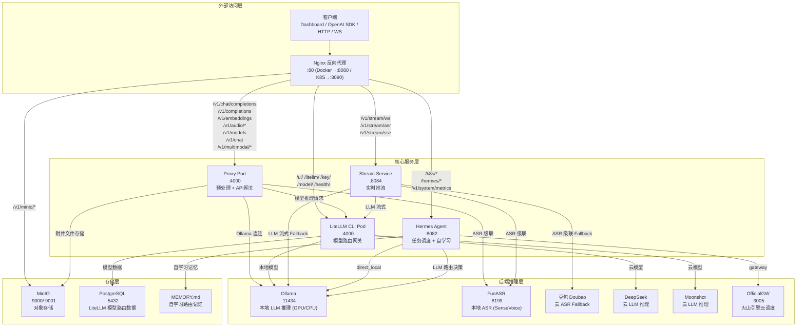
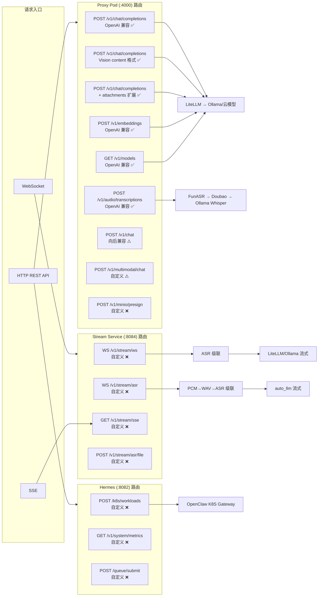
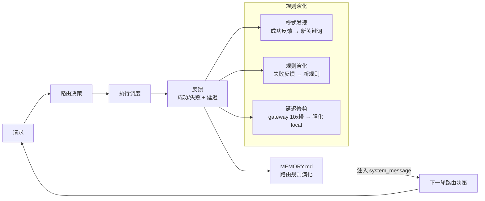
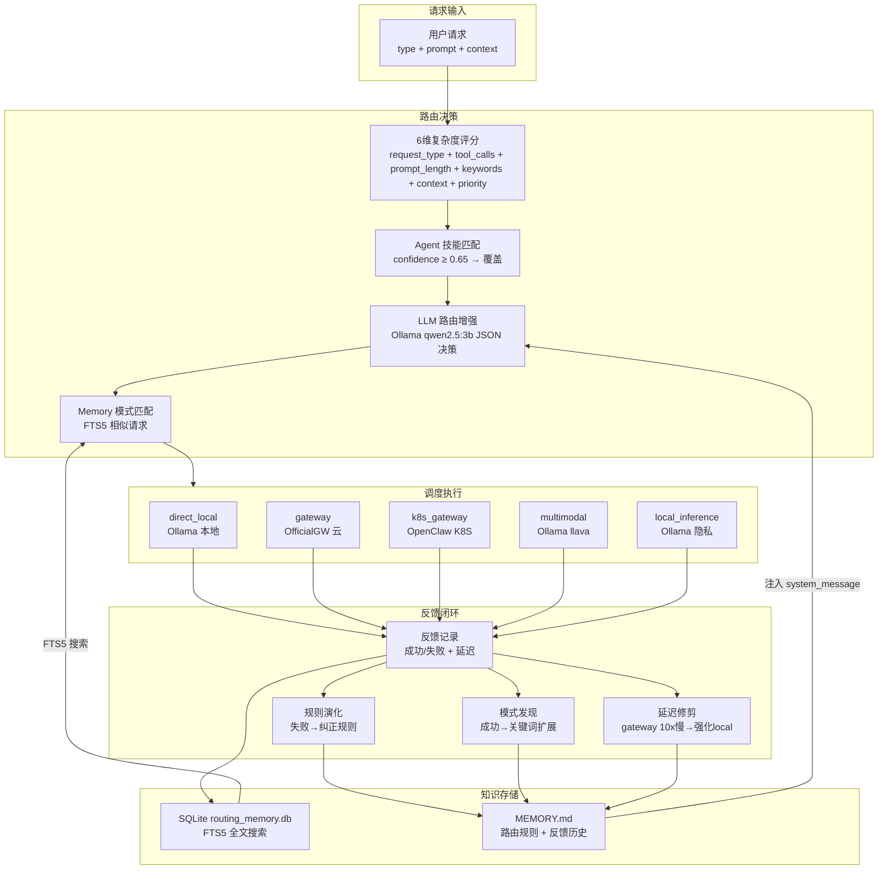

# OpenClaw Multi-Agent 项目架构文档

> 版本: feature_OpenAI_compatible 分支 | 更新日期: 2026-06-26

---

## 一、项目概述

OpenClaw Multi-Agent 是一个多 Agent 智能 LLM 请求调度系统。它通过 Hermes Agent 核心调度层，利用自学习反馈闭环和 Smart Router 复杂度评分，将请求路由到五种路径（direct_local、gateway、k8s_gateway、multimodal、local_inference）。系统提供 OpenAI 兼容 REST API 作为主要接口，同时保留 WebSocket 实时推流等自定义协议。

**核心设计原则**:
- Proxy Pod 是唯一的 LLM API 入口（预处理 + 模型路由）
- LiteLLM CLI Pod 是模型路由网关（本地 + 云模型）
- Stream Service 处理所有实时推流（WebSocket + SSE）
- Hermes 专注 K8S 任务调度和自学习路由

---

## 二、系统架构图

### 2.1 全局服务拓扑

```
┌─────────────────────────────────────────────────────────────────────────────┐
│                           外部访问层                                        │
│  ┌───────────────────────────────────────────────────────────────────────┐  │
│  │  客户端: 浏览器 Dashboard / OpenAI SDK / 自定义 HTTP / WebSocket       │  │
│  │  访问入口: Docker→:8080 / K8S→:8090 (NodePort 30080)                  │  │
│  └───────────────────────────────────────────────────────────────────────┘  │
│                                    │                                        │
│                                    ▼                                        │
│  ┌───────────────────────────────────────────────────────────────────────┐  │
│  │                    Nginx 反向代理 + 负载均衡 (:80)                      │  │
│  │  ┌─────────────────────────────────────────────────────────────────┐  │  │
│  │  │ upstream: litellm_backend(least_conn)  proxy:4000              │  │  │
│  │  │ upstream: proxy_backend(least_conn)    proxy:4000              │  │  │
│  │  │ upstream: hermes_backend(least_conn)   hermes:8082             │  │  │
│  │  │ upstream: stream_backend(ip_hash)      stream:8084             │  │  │
│  │  └─────────────────────────────────────────────────────────────────┘  │  │
│  └───────────────────────────────────────────────────────────────────────┘  │
│         │              │              │              │              │         │
│         ▼              ▼              ▼              ▼              │         │
│  ┌──────────┐  ┌──────────┐  ┌──────────┐  ┌──────────┐    ┌──────────┐   │
│  │Proxy Pod │  │LiteLLM   │  │Hermes    │  │Stream    │    │  MinIO   │   │
│  │  :4000   │  │CLI Pod   │  │Agent     │  │Service   │    │  :9000   │   │
│  │预处理+   │  │  :4000   │  │  :8082   │  │  :8084   │    │ :9001UI │   │
│  │API网关   │  │模型路由  │  │任务调度  │  │实时推流  │    │对象存储  │   │
│  └──────────┘  └──────────┘  └──────────┘  └──────────┘    └──────────┘   │
│         │              │              │              │                       │
│         │     ┌────────┴─────┐       │       ┌──────┴──────┐               │
│         │     │              │       │       │             │               │
│         │     ▼              ▼       │       ▼             ▼               │
│         │  ┌──────────┐ ┌──────────┐│  ┌──────────┐ ┌──────────┐          │
│         │  │  Ollama  │ │ 云模型   ││  │  FunASR  │ │  豆包    │          │
│         │  │ :11434   │ │DeepSeek ││  │  :8199   │ │  Doubao  │          │
│         │  │本地推理  │ │Moonshot ││  │SenseVoice│ │ 云ASR    │          │
│         │  │(GPU/CPU) │ │ 云推理  ││  │本地ASR   │ │  Fallback│          │
│         │  └──────────┘ └──────────┘│  └──────────┘ └──────────┘          │
│         │                     │     │                                    │
│         └─────────────────────┘     │                                    │
│                    ▲                │                                     │
│                    │                ▼                                     │
│              ┌──────────┐    ┌──────────┐                               │
│              │LiteLLM DB│    │OfficialGW│                               │
│              │PostgreSQL│    │  :3005   │                               │
│              │  :5432   │    │火山引擎  │                               │
│              │ 模型路由 │    │云调度    │                               │
│              │ 数据存储 │    │          │                               │
│              └──────────┘    └──────────┘                               │
│                                                                           │
└─────────────────────────────────────────────────────────────────────────────┘
```

### 2.2 Mermaid 架构图



### 2.3 请求路由全景图



---

## 三、服务清单

### 3.1 服务端口一览

| 服务 | 端口 | 协议 | 部署方式 | 说明 |
|------|------|------|---------|------|
| Nginx | 80 (Docker→8080 / K8S→8090) | HTTP | Docker + K8S | 反向代理 + 负载均衡 |
| Proxy Pod | 4000 | HTTP | K8S | 预处理 + API 网关 + OpenAI 兼容端点 |
| LiteLLM CLI Pod | 4000 | HTTP | Docker + K8S | 模型路由网关 (管理 UI + 后端路由) |
| Hermes Agent | 8082 | HTTP | Docker + K8S | 任务调度 + 自学习路由 |
| Stream Service | 8084 | HTTP + WS + SSE | Docker + K8S | 实时推流 + WebSocket |
| Ollama | 11434 | HTTP | Docker + K8S | 本地 LLM 推理引擎 |
| FunASR | 8199 | HTTP | Docker + K8S | 本地 ASR (SenseVoice) |
| MinIO | 9000/9001 | HTTP | Docker + K8S | 对象存储 + Console |
| PostgreSQL | 5432 | TCP | Docker + K8S | LiteLLM 模型路由数据 |
| OfficialGW | 3005 | HTTP | Docker (可选) | 火山引擎云调度 |
| Gateway | 3000 | HTTP | 本地 | 自定义 LLM 网关 (替代/遗留) |
| Bridge | 3001 | HTTP | 本地 | 编排层 (替代/遗留) |
| Scheduler | 8000 | HTTP | 本地 | Python 调度器 (替代/遗留) |
| Hermes Agent (Official) | 8642 | HTTP | 本地 | 官方 Agent API |

### 3.2 服务资源分配 (K8S)

| Pod | 副本数 (min/max) | CPU req/limit | 内存 req/limit | HPA 策略 | 存储 |
|-----|--------------------|---------------|---------------|---------|------|
| nginx | 1 (固定) | 50m/250m | 64Mi/256Mi | — | — |
| proxy | 1-5 | 500m/500m | 256Mi/512Mi | CPU ≥ 70% | — |
| litellm | 1-5 | 250m/1000m | 512Mi/2Gi | CPU ≥ 70% / Mem ≥ 80% | — |
| litellm-db | 1 (Recreate) | 100m/500m | 128Mi/512Mi | — | 5Gi PVC |
| hermes | 1 (固定) | 50m/100m | 128Mi/256Mi | — | — |
| stream-service | 1-5 | 200m/500m | 256Mi/512Mi | CPU ≥ 60% | — |
| funasr | 1 (Recreate) | 1000m/2000m | 2Gi/4Gi | — | — |
| ollama | 1 (Recreate) | 2/8 cores | 4Gi/12Gi | — | 50Gi PVC |
| minio | 1 (Recreate) | 100m/500m | 128Mi/512Mi | — | 20Gi PVC |

**最小资源**: ~8 CPU / 9.3 Gi 内存
**最大资源 (HPA 全满)**: ~20.5 CPU / 26.3 Gi 内存
**持久存储**: 75Gi (ollama 50Gi + minio 20Gi + postgres 5Gi)

### 3.3 外部访问路径

| 环境 | 入口端口 | Ollama 直连 | MinIO Console | LiteLLM UI |
|------|---------|------------|-------------|-----------|
| Docker Compose | `:8080` | `:11434` | `:9001` | `:8080/ui/` |
| K8S (KinD) | `:8090` | `:11435` | `:9002` | `:8090/ui/` |
| 本地开发 | `:4000` (Proxy 直连) | `:11434` | — | — |

---

## 四、核心模块详解

### 4.1 Proxy Pod (`hermes/litellm_proxy.py`)

**角色**: 系统唯一的 LLM API 入口点，负责预处理 + 模型路由 + OpenAI 兼容接口

**核心能力**:
- ✅ OpenAI 兼容 Chat/Vision/Embeddings/ASR/Models API
- ✅ 附件预处理 (PDF→文本, Word→文本, 音频→ASR→文本, 图片→base64)
- ✅ Vision 自动路由 (检测图片 → 切换 llava 模型)
- ✅ ASR 级联 (FunASR → Doubao → Ollama Whisper)
- ✅ MinIO presigned URL 生成
- ✅ Dashboard 静态文件服务

**持久连接池**:
```
_litellm_chat_client  → LiteLLM Proxy :4000 (chat/stream)
_ollama_chat_client   → Ollama :11434  (chat/stream fallback)
_litellm_asr_client   → LiteLLM Proxy :4000 (ASR)
_funasr_asr_client    → FunASR :8199   (ASR primary)
_ollama_asr_client    → Ollama :11434  (ASR fallback)
_litellm_embed_client → LiteLLM Proxy :4000 (embeddings)
_ollama_embed_client  → Ollama :11434  (embeddings fallback)
_download_client      → 任意 URL       (附件下载)
```

**关键端点**:

| 端点 | 方法 | OpenAI 兼容 | 功能 |
|------|------|:---:|------|
| `/v1/chat/completions` | POST | ✅ | Chat/Vision/Attachments |
| `/v1/completions` | POST | ✅ | 文本补全 |
| `/v1/embeddings` | POST | ✅ | 文本向量化 |
| `/v1/audio/transcriptions` | POST | ✅ | ASR (multipart + JSON URL) |
| `/v1/models` | GET | ✅ | 模型列表 |
| `/v1/chat` | POST | ⚠️ | 向后兼容统一入口 (按 type 路由) |
| `/v1/multimodal/chat` | POST | ⚠️ | 多模态 (自动路由图片/音频/PDF) |
| `/v1/minio/presign` | POST | ❌ | MinIO presigned URL |
| `/health` | GET | — | 健康检查 + 能力列表 |

### 4.2 Stream Service (`hermes/stream_service.py`)

**角色**: 实时推流服务 — WebSocket 双向对话 + SSE 单向 + 流式 ASR

**核心能力**:
- ✅ WebSocket 双向实时对话 (文本 + 音频)
- ✅ WebSocket 流式 ASR + auto_llm 边听边答
- ✅ SSE 单向 LLM 推流
- ✅ HTTP 文件上传 ASR
- ✅ ASR 级联 (FunASR → Doubao → Ollama Whisper)
- ✅ LLM 流式 (LiteLLM → Ollama fallback)

**关键端点**:

| 端点 | 方法 | 功能 | 协议 |
|------|------|------|------|
| `/v1/stream/ws` | WebSocket | 双向实时对话 + 语音输入 | WS |
| `/v1/stream/asr` | WebSocket | PCM 流式 ASR + auto_llm | WS |
| `/v1/stream/sse` | GET | SSE 单向 LLM 推流 | HTTP SSE |
| `/v1/stream/asr/file` | POST | 文件上传 ASR | HTTP multipart |
| `/v1/stream/health` | GET | 健康检查 | HTTP |

**音频处理常量**:

| 常量 | 值 | 说明 |
|------|-----|------|
| `STREAM_ASR_MIN_BYTES` | 32000 | ASR 最小刷新阈值 (~1s) |
| `STREAM_ASR_MAX_BYTES` | 320000 | ASR 强制刷新阈值 (~10s) |
| `STREAM_ASR_INTERVAL` | 2.0s | ASR 最小刷新间隔 |
| PCM 格式 | 16kHz 16bit mono | 音频输入要求 |

**单服务部署模式**: Stream Service 可挂载 litellm_router，单独部署即可提供所有 API 功能（chat + stream + ASR）。

### 4.3 Hermes Agent (`hermes/server.py`)

**角色**: 任务调度 + 自学习路由引擎 + K8S 工作负载管理

**核心能力**:
- ✅ 消息队列调度 (InProcess/Redis 双后端)
- ✅ DispatchWorker 线程池 (4 worker)
- ✅ 自学习路由闭环 (MEMORY.md 反馈 → 规则演化)
- ✅ K8S AIWorkload 生命周期管理
- ✅ 5 路径调度 (direct_local / gateway / k8s_gateway / multimodal / local_inference)
- ✅ 服务 Watchdog (自动重启)

**并发控制**:

| 信号量 | 限制 | 说明 |
|--------|------|------|
| `_routing_semaphore` | 1 | LLM 路由决策互斥 (共享 GPU) |
| `_ollama_semaphore` | 2 | Ollama 推理并发上限 |
| `_gw_semaphore` | 3 | OfficialGW 容量限制 |

**关键端点** (40+):

| 类别 | 端点 | 功能 |
|------|------|------|
| 调度 | `/route`, `/v1/chat` | 智能路由 + 统一入口 |
| 队列 | `/queue/submit`, `/queue/submit-sync`, `/queue/results`, `/queue/status` | 异步/同步队列操作 |
| K8S | `/k8s/workloads`, `/k8s/workloads/{id}`, `/k8s/callback` | AIWorkload CRUD |
| 学习 | `/skills`, `/memory/recent`, `/memory/search`, `/evolution`, `/reset` | 自学习管理 |
| Agent | `/agent`, `/agent/config`, `/agent/bootstrap`, `/agent/skills` | Agent 管理 |
| 系统 | `/health`, `/stats`, `/state`, `/v1/system/metrics` | 监控 |

### 4.4 HermesRouter (`hermes/router.py`)

**角色**: 核心路由智能 — 复杂度评分 + 技能匹配 + 自学习

**路由路径**:

| RoutePath | 说明 | 目标后端 |
|-----------|------|---------|
| `DIRECT_LOCAL` | 简单本地推理 | Ollama :11434 |
| `GATEWAY` | 云网关推理 | OfficialGW :3005 |
| `LOCAL_INFERENCE` | 隐私保护本地推理 | Ollama (隐私约束) |
| `MULTIMODAL` | 多模态推理 | Ollama llava 模型 |
| `AGENT_CHAIN` | Agent 链式推理 | 多步 Agent 组合 |
| `DIRECT_CLOUD` | 直接云推理 | DeepSeek/Moonshot |

**6维复杂度评分**:

| 维度 | 权重范围 | 评分因素 |
|------|---------|---------|
| request_type | 5-40 | chat=5, tool_call=35, code=45 |
| tool_calls | 30+10n | 工具调用数量 |
| prompt_length | 0-18 | 文本长度分级 |
| keywords | 0-20 | 高/中复杂度关键词匹配 |
| context | 0-15 | 上下文条目数 × 5 |
| priority | -5~+10 | CRITICAL=10, BACKGROUND=-5 |

**路由决策级联**:
```
1. 隐私覆盖 → LOCAL_INFERENCE
2. 多模态检测 → MULTIMODAL
3. 工具调用 → GATEWAY
4. 高复杂度 (≥threshold) → GATEWAY/AGENT_CHAIN
5. 简单默认 → DIRECT_LOCAL

增强决策:
  → OfficialHermesAdapter (Ollama LLM 路由)
  → HermesAgent (技能匹配)
  → LLMEnhancer (LLM 分类增强)
  → RoutingMemory (FTS5 模式匹配)
  → 最终保护: 4 类覆盖重新验证
```

**自学习闭环**:



### 4.5 DispatchWorker (`hermes/dispatch_worker.py`)

**角色**: 队列驱动的请求调度执行器

**工作流程**:
```
[QUEUE_REQUESTS] → Worker Thread → _process_request()
  → _routing_semaphore (limit=1): OfficialHermesAdapter.route_via_agent()
  → _dispatch(): 根据 route_path 调度
    → direct_local: POST Ollama /v1/chat/completions
    → gateway: POST OfficialGW /v1/chat/completions
    → k8s_gateway: POST OpenClaw K8S Gateway /workloads
    → multimodal: POST Ollama /v1/chat/completions (llava model)
    → local_inference: POST Ollama /v1/chat/completions (隐私)
  → _record_feedback()
  → push result → [QUEUE_RESULTS]
  → notify sync waiter (threading.Event)
```

### 4.6 OfficialHermesAdapter (`hermes/official_agent_adapter.py`)

**角色**: Agent 模式适配器 — system_message 注入 + Memory 闭环

**路由模式**:

| 模式 | 延迟 | 方式 | 说明 |
|------|------|------|------|
| `ollama_direct` | ~1-2s | Ollama LLM 路由 | 默认模式，用 qwen2.5:3b 做 JSON 路由决策 |
| `hermes_agent` | ~5s | Hermes Agent API | 备用模式，调用 Official Agent API |
| 关键词 fallback | ~0ms | 规则匹配 | 熔断器：Ollama 超时 2 次 → 120s 内跳过 LLM |

**MEMORY.md 反馈闭环**:
- `_load_memory_context()`: 读取路由规则 (10s 缓存)
- `_build_routing_system_message()`: 动态构建 system prompt
- `_write_feedback_to_memory()`: 滚动窗口反馈 + 规则演化
- `_evolve_rule_from_feedback()`: 失败反馈 → 提取纠正规则
- `_discover_and_add_pattern()`: 成功反馈 → 扩展关键词
- `_prune_latency_gap()`: gateway 10x 延迟 → 强化 local 路由

### 4.7 Message Queue (`hermes/message_queue.py`)

**角色**: 请求/结果/反馈队列抽象层

| 后端 | 适用场景 | 持久化 | 分布式 |
|------|---------|--------|--------|
| `InProcessQueue` | 单节点开发 | JSONL 文件 (`.hermes/queues/`) | ❌ |
| `RedisQueue` | 生产分布式 | Redis 持久化 | ✅ |
| `auto` | 默认 | 尝试 Redis → fallback InProcess | ✅/❌ |

**队列名称**:
- `openclaw:requests` — 请求队列
- `openclaw:results` — 结果队列 (max 50 条自动裁剪)
- `openclaw:feedback` — 反馈队列 (max 50 条自动裁剪)

---

## 五、请求流详解

### 5.1 OpenAI 兼容 Chat 请求流

```
客户端                      Nginx (:80)               Proxy (:4000)           LiteLLM (:4000)         Ollama (:11434)
  │                           │                          │                       │                       │
  │──POST /v1/chat/completions──→│──proxy_pass proxy_backend──→│                          │                       │
  │  {model:"qwen2.5",           │                          │                       │                       │
  │   messages:[...],            │                          │                       │                       │
  │   stream:true}               │                          │                       │                       │
  │                              │                          │                       │                       │
  │                              │                          │ 1. 解析 ChatCompletionRequest             │
  │                              │                          │ 2. 检查 attachments (无)                 │
  │                              │                          │ 3. 检查 vision (无)                      │
  │                              │                          │                       │                       │
  │                              │                          │──POST /v1/chat/completions───────────→│──路由到 qwen2.5──────→│──推理────→│
  │                              │                          │  {stream:true, ...}   │   Authorization      │                       │
  │                              │                          │                       │                       │
  │                              │                          │←──SSE data stream─────│←──SSE data stream────│←──SSE delta──────────│
  │←──SSE data stream───────────│←──SSE data stream──────│←──SSE data stream─────│                       │                       │
  │←──data: [DONE]──────────────│←──data: [DONE]─────────│←──data: [DONE]────────│                       │                       │
```

### 5.2 Vision 请求流

```
客户端 → Nginx → Proxy
  POST /v1/chat/completions
  {model:"qwen2.5",
   messages:[{role:"user",
     content:[
       {type:"text", text:"描述图片"},
       {type:"image_url", image_url:{url:"http://minio/img.png"}}
     ]}]}

Proxy 处理:
  1. 检测 content 中含 image_url → 自动切换 llava 模型
  2. 外部 URL → _download_client 下载 → base64 编码
  3. 构建 Ollama 格式: images=[base64_data]
  4. model 改为 "llava"

  → POST LiteLLM /v1/chat/completions {model:"llava", images:[...]}
  → 或 POST Ollama /api/generate {model:"llava", images:[...]}
```

### 5.3 Audio Attachment 请求流

```
客户端 → Nginx → Proxy
  POST /v1/chat/completions
  {model:"qwen2.5",
   messages:[{role:"user", content:"总结以下音频"}],
   attachments:[{type:"audio", url:"http://minio/audio.wav"}]}

Proxy 处理:
  1. 检测 attachments 中含 audio
  2. _download_client 下载音频文件
  3. _transcribe_audio(audio_bytes) → FunASR → Doubao → Whisper 级联
  4. ASR 结果 "今天天气怎么样" 替换原始 prompt
  5. 构建 messages: [{role:"user", content:"今天天气怎么样"}]

  → POST LiteLLM /v1/chat/completions {messages:[...]}
```

### 5.4 WebSocket 流式 ASR 请求流

```
客户端 → Nginx → Stream Service (:8084)

  WS CONNECT /v1/stream/asr

  ← {type:"connected", session_id, asr_provider, funasr_url}

  → {type:"config", auto_llm:true, model:"qwen2.5"}
  ← {type:"config_ack", auto_llm:true, model:"qwen2.5"}

  → [3200 bytes PCM] (每 100ms 一块)
  → [3200 bytes PCM]
  → ... (累积到 ≥32000 bytes 且 ≥2.0s)

  ← {type:"asr_partial", content:"今天天气", is_final:false}
  ← {type:"asr_partial", content:"怎么样", is_final:false}

  ← {type:"llm_chunk", content:"很"} (auto_llm ≥2 ASR 结果触发)
  ← {type:"llm_chunk", content:"抱歉"}
  ← {type:"llm_done", content:"很抱歉..."}

  → {type:"stop"}
  ← {type:"asr_final", content:"我想出去散步", segments:1}
  ← {type:"llm_chunk", ...} (最终 LLM 回复)
  ← {type:"llm_done", ...}
```

### 5.5 K8S AIWorkload 请求流

```
客户端 → Nginx → Hermes (:8082)

  POST /k8s/workloads
  {type:"k8s_workload", spec:{...}}

Hermes 处理:
  → OfficialHermesAdapter.route_via_agent()
    → K8S 快速路径: 直接返回 k8s_gateway (跳过 LLM 路由)
  → DispatchWorker._dispatch_to_k8s_gateway()
    → POST OpenClaw K8S Gateway /plugins/k8s/v1/workloads

  ← 202 Accepted {workload_id}

  (异步回调)
  → POST /k8s/callback {workload_id, status:"completed", ...}
  → 更新结果到 QUEUE_RESULTS
```

---

## 六、Nginx 路由规则

### 6.1 Upstream 配置

| Upstream | 算法 | 后端 | Keepalive |
|----------|------|------|-----------|
| `litellm_backend` | least_conn | litellm:4000 | 32 |
| `proxy_backend` | least_conn | proxy:4000 | 32 |
| `hermes_backend` | least_conn | hermes:8082 | 16 |
| `stream_backend` | ip_hash | stream-service:8084 | — |
| `stream_ws_backend` | round-robin | stream-service:8084 | — |

> `stream_backend` 使用 ip_hash 保证 WebSocket 会话粘性

### 6.2 Location 路由表

| Location | 目标 Upstream | 说明 | 特殊配置 |
|----------|-------------|------|---------|
| `/v1/chat/completions` | proxy_backend | OpenAI Chat API ✅ | SSE, 300s timeout |
| `/v1/completions` | proxy_backend | OpenAI 补全 API ✅ | 300s timeout |
| `/v1/embeddings` | proxy_backend | OpenAI 向量 API ✅ | — |
| `/v1/audio/` | proxy_backend | OpenAI ASR API ✅ | 50m body, 120s |
| `/v1/models` | proxy_backend | OpenAI 模型列表 ✅ | — |
| `= /v1/chat` | proxy_backend | 向后兼容入口 ⚠️ | exact match, 300s |
| `/v1/multimodal/` | proxy_backend | 多模态自定义 ⚠️ | 120s, 50m |
| `= /v1/minio/presign` | proxy_backend | MinIO URL 生成 ❌ | 10s |
| `/v1/stream/ws` | stream_ws_backend | WebSocket 对话 ❌ | Upgrade, 3600s |
| `/v1/stream/asr` | stream_ws_backend | WebSocket ASR ❌ | Upgrade, 3600s |
| `/v1/stream/sse` | stream_backend | SSE 推流 ❌ | no-buffering, 3600s |
| `/v1/stream/asr/file` | stream_backend | 文件上传 ASR ❌ | 50m, 120s |
| `/k8s/` | hermes_backend | K8S 任务调度 ❌ | 120s |
| `/hermes/health` | hermes_backend | Hermes 健康检查 | — |
| `/hermes/stats` | hermes_backend | Hermes 统计 | — |
| `= /v1/system/metrics` | hermes_backend | 系统资源监控 | — |
| `/ui/`, `/litellm/`, `/key/`, `/model/` 等 | litellm_backend | LiteLLM 管理 UI | 注入 Bearer auth |
| `/dashboard.html`, `/static/` | proxy_backend | Dashboard | — |
| `/v1/minio/` | minio:9000 | MinIO S3 API | — |

---

## 七、配置体系

### 7.1 配置文件层级

```
openclaw.json         ← 主配置 (模型目录 + Smart Router 规则)
.env / .env.example   ← 环境变量 (API Keys + 端口 + 阈值)
docker/litellm_config.yaml ← Docker LiteLLM 模型路由
k8s/02-configmaps.yaml ← K8S LiteLLM + Nginx ConfigMap
docker/nginx.conf     ← Docker Nginx 路由规则
hermes/watchdog_config.json ← 服务 Watchdog 配置
```

### 7.2 模型配置

**Docker Compose 模型目录** (`docker/litellm_config.yaml`):

| 模型名 | 类型 | 后端 | 别名 |
|--------|------|------|------|
| qwen2.5 | 本地 LLM | ollama/qwen2.5:7b | chat |
| llava | 本地 Vision | ollama/llava:7b | vision |
| deepseek-chat | 云 LLM | deepseek/deepseek-chat | — |
| moonshot-chat | 云 LLM | moonshot/moonshot-v1-8k | — |
| funasr | 本地 ASR | openai/whisper-1 → funasr:8199 | asr |
| doubao-asr | 云 ASR | openai/whisper-1 → 豆包 | asr-cloud |
| bge-embedding | 本地 Embedding | ollama/nomic-embed-text | embedding |

**K8S 模型目录** (`k8s/02-configmaps.yaml`):

| 模型名 | 类型 | 后端 | 说明 |
|--------|------|------|------|
| qwen2.5 | 本地 LLM | ollama/qwen2.5:3b | 3B 轻量版 (K8S 资源有限) |
| llava | 本地 Vision | ollama/llava:7b | — |
| funasr | 本地 ASR | openai/whisper-1 → funasr:8199 | — |
| bge-embedding | 本地 Embedding | ollama/nomic-embed-text | — |

> Docker 用 7B 模型，K8S 用 3B 模型（资源受限环境）

### 7.3 环境变量分组

| 分组 | 关键变量 | 说明 |
|------|---------|------|
| API Keys | `MOONSHOT_API_KEY`, `DEEPSEEK_API_KEY`, `LITELLM_MASTER_KEY`, `DOUBAO_ASR_KEY` | 云服务认证 |
| 服务端口 | `GATEWAY_PORT=3000`, `BRIDGE_PORT=3001`, `HERMES_PORT=8082`, `APP_PORT=4000`, `STREAM_PORT=8084` | 服务端口 |
| 后端 URL | `OLLAMA_URL`, `EXTERNAL_LITELLM_URL`, `FUNASR_URL`, `OPENCLAW_OFFICIAL_GATEWAY_URL` | 后端连接 |
| Smart Router | `SMART_ROUTER_THRESHOLD=40`, `HERMES_COMPLEXITY_THRESHOLD=40`, `HERMES_EXPLORATION_RATE=0.1` | 路由参数 |
| 队列 | `QUEUE_BACKEND=auto` (Redis→InProcess), `WATCHDOG_ENABLED=false` (K8S 禁用) | 基础设施 |
| MinIO | `MINIO_ENDPOINT`, `MINIO_ACCESS_KEY`, `MINIO_SECRET_KEY`, `MINIO_BUCKET`, `MINIO_SECURE` | 对象存储 |

---

## 八、数据持久化

### 8.1 存储架构

| 组件 | 存储方式 | 路径 | 说明 |
|------|---------|------|------|
| Ollama 模型 | PVC 50Gi | `/root/.ollama` | 模型权重 + 运行时 |
| MinIO 对象 | PVC 20Gi | `/data` | 上传文件 + ASR 音频 |
| PostgreSQL | PVC 5Gi | `/var/lib/postgresql/data` | LiteLLM 路由数据 |
| Hermes 队列 | JSONL | `.hermes/queues/*.jsonl` | 请求/结果/反馈 |
| Hermes 记忆 | SQLite + MD | `.hermes/memories/MEMORY.md` | 路由规则 + 演化日志 |
| Hermes 路由 | SQLite | `.hermes/routing_memory.db` | FTS5 路由历史 + 技能 |

### 8.2 MinIO 使用场景

- 附件上传: Dashboard → MinIO presigned URL → 上传文件 → 请求引用 URL
- ASR 音频: 客户端上传音频到 MinIO → 请求引用 URL → Proxy/Stream 下载 → ASR
- 图片存储: Vision 图片上传 MinIO → Proxy 下载 → base64 → llava 推理

---

## 九、自学习系统

### 9.1 自学习闭环架构



### 9.2 MEMORY.md 结构

```markdown
# Hermes Routing Memory

## Routing Patterns Learned
- 简单问答 → direct_local (延迟 1-3s)
- 工具调用 → gateway (延迟 5-10s)
- 多模态 → multimodal (延迟 3-8s)
- 隐私请求 → local_inference (零云延迟)

## Key Rules
- 代码生成/执行 → gateway (需要工具调用能力)
- 包含关键词"分析/对比/推理" → gateway (复杂推理)
- 包含关键词"你好/天气/简单" → direct_local (简单问答)
- 包含附件/图片/音频 → multimodal (需要预处理)

## Feedback History (最近 10 条)
- [成功] qwen2.5:3b direct_local, 延迟 2.3s, prompt="你好"
- [失败] gateway timeout, 延迟 30s → 规则演化: 简单请求强制 local

## Latency Stats
- direct_local: avg 2.5s, p95 4.8s
- gateway: avg 8.2s, p95 15.6s
- multimodal: avg 5.1s, p95 9.2s
```

---

## 十、遗留/替代服务

以下服务不是主要路径，作为替代或遗留架构保留：

### 10.1 Gateway (`gateway/gateway.mjs` :3000)

**角色**: 自定义 LLM HTTP 网关（非 OpenAI 兼容）

- 基本模型代理，从 `openclaw.json` 加载模型目录
- 不支持预处理、ASR、附件、Vision
- 被 Proxy Pod 的 OpenAI 兼容 API 取代

### 10.2 Bridge (`bridge/orchestrator.mjs` :3001)

**角色**: 智能编排层 — 管理 Gateway + OfficialGW + 路由到 Hermes

- 管理 Gateway 和 OfficialGW 进程生命周期
- 路由请求到 Hermes 或直接到后端
- 被 Hermes DispatchWorker + Proxy Pod 取代

### 10.3 Scheduler (`scheduler/` :8000)

**角色**: Python 调度器 — Hook 系统 + 策略路由

- 4 种策略: adaptive / priority / load_balance / 自定义
- Pre/Post Hook: 验证、限流、成本计算、重试
- 3 种 Agent: local / cloud / openclaw
- 被 Hermes Router + DispatchWorker 取代

### 10.4 OpenClaw GW Mock (`openclaw-gw-mock.mjs` :3005)

**角色**: 模拟火山引擎云调度（测试用）

---

## 十一、测试体系

### 11.1 测试文件一览

| 文件 | 类型 | 说明 |
|------|------|------|
| `tests/e2e_sequential.py` | Playwright E2E | 10 个场景顺序测试 |
| `tests/e2e_concurrent_diag.py` | Playwright | 并发 SSE 诊断 |
| `tests/e2e_full_playwright.py` | Playwright | 全功能 E2E |
| `tests/test_unified_api.py` | HTTP 集成 | `/v1/chat` 统一入口测试 |
| `tests/test_regression.py` | HTTP 集成 | 全链路回归测试 |
| `tests/test_stream_asr_real.py` | WebSocket | 流式 ASR 真实语音测试 |
| `tests/verify_k8s_config.py` | K8S 配置 | YAML/nginx/Secret 验证 |
| `tests/benchmark_httpx_pool.py` | 性能基准 | 连接池性能对比 |
| `hermes/test_routing_strategy.py` | 单元 | 路由策略测试 |
| `hermes/test_hybrid_routing.py` | 单元 | 混合路由测试 |
| `hermes/test_llm_enhancer.py` | 单元 | LLM 增强器测试 |
| `hermes/test_agent.py` | 单元 | Agent 测试 |

### 11.2 E2E 测试场景 (10/10)

| # | 场景 | 端点 | OpenAI 兼容 |
|---|------|------|:---:|
| 1 | Chat | `POST /v1/chat/completions` | ✅ |
| 2 | Vision | `POST /v1/chat/completions` (Vision content) | ✅ |
| 3 | PDF Attachment | `POST /v1/chat/completions` + attachments | ✅ |
| 4 | Word Attachment | `POST /v1/chat/completions` + attachments | ✅ |
| 5 | Audio Attachment | `POST /v1/chat/completions` + attachments | ✅ |
| 6 | ASR | `POST /v1/audio/transcriptions` | ✅ |
| 7 | WebSocket Chat | `WS /v1/stream/ws` | ❌ |
| 8 | WebSocket ASR | `WS /v1/stream/asr` | ❌ |
| 9 | MinIO Presign | `POST /v1/minio/presign` | ❌ |
| 10 | Multimodal | `POST /v1/chat/completions` (Vision content) | ✅ |

---

## 十二、OpenAI SDK 兼容性

### 12.1 兼容端点

```python
from openai import OpenAI

client = OpenAI(
    base_url="http://localhost:8090/v1",   # Docker→8080 / K8S→8090
    api_key="sk-litellm-local"
)

# 1. Chat
r = client.chat.completions.create(
    model="qwen2.5",
    messages=[{"role": "user", "content": "你好"}],
    stream=True
)

# 2. Vision
r = client.chat.completions.create(
    model="qwen2.5",  # 自动切换 llava
    messages=[{"role": "user", "content": [
        {"type": "text", "text": "描述这张图片"},
        {"type": "image_url", "image_url": {"url": "http://minio/img.png"}}
    ]}]
)

# 3. Attachments (extra_body)
r = client.chat.completions.create(
    model="qwen2.5",
    messages=[{"role": "user", "content": "总结以下PDF"}],
    extra_body={"attachments": [{"type": "pdf", "url": "http://minio/doc.pdf"}]}
)

# 4. Embeddings
r = client.embeddings.create(model="bge-embedding", input="你好")

# 5. ASR (multipart mode)
with open("audio.wav", "rb") as f:
    r = client.audio.transcriptions.create(model="funasr", file=f)
```

### 12.2 不兼容功能

| 功能 | 原因 | 替代方案 |
|------|------|---------|
| ws_chat | OpenAI 无 WebSocket 标准 | 直接 WebSocket 调用 |
| ws_asr | OpenAI 无流式 ASR 标准 | 直接 WebSocket 调用 |
| SSE 推流 | 非标准 SSE 格式 | 用 `stream=True` 的 chat/completions |
| MinIO presign | OpenAI 无文件存储标准 | 直接 HTTP 调用 |
| K8S AIWorkload | OpenAI 无任务调度标准 | 直接 HTTP 调用 |

---

## 十三、部署指南

### 13.1 Docker Compose 部署

```bash
cd docker
docker compose up -d                          # 启动所有服务
docker compose up -d --scale litellm=3        # 扩展 LiteLLM
docker compose down                            # 停止

# 访问
http://localhost:8080/new_dashboard.html       # Dashboard
http://localhost:8080/ui/                       # LiteLLM 管理 UI
http://localhost:9001                           # MinIO Console
```

### 13.2 K8S (KinD) 部署

```bash
cd k8s
./deploy.sh                                    # 一键部署
./deploy.sh --destroy                          # 销毁集群
./deploy.sh --status                           # 查看状态
./deploy.sh --pull-model                       # 拉取 Ollama 模型

# 访问
http://localhost:8090/new_dashboard.html       # Dashboard
http://localhost:8090/ui/                       # LiteLLM 管理 UI
http://localhost:9002                           # MinIO Console
```

### 13.3 本地开发部署

```bash
# 启动所有服务
./start-all.sh

# 或逐个启动
python -m hermes.litellm_proxy    # Proxy (:4000)
python -m hermes.stream_service   # Stream (:8084)
python -m hermes.server           # Hermes (:8082)

# 健康检查
curl http://localhost:4000/health
curl http://localhost:8084/health
curl http://localhost:8082/health
```

---

## 十四、关键设计决策

| 决策 | 原因 | 影响 |
|------|------|------|
| Proxy Pod 为唯一 LLM 入口 | 预处理能力对所有请求生效 | Nginx 路由简化，LiteLLM 不对外 |
| OpenAI 兼容为主接口 | SDK 客户端可直接对接 | 7/10 功能兼容，3/10 保留自定义 |
| Stream Service ip_hash | WebSocket 会话粘性 | 同一客户端始终路由到同一 Pod |
| K8S qwen2.5:3b (vs Docker 7B) | K8S 资源受限 | 推理质量略低，延迟略快 |
| Hermes WATCHDOG_ENABLED=false | K8S 有自身健康检查 | 避免 Watchdog 和 K8S 双重重启 |
| LiteLLM 管理 UI 注入 Bearer | 无缝 Dashboard 访问 | 用户无需手动登录管理 UI |
| InProcessQueue JSONL 持久化 | 单节点开发无需 Redis | 生产切换到 RedisQueue 即可 |
| 信号量并发控制 | GPU 资源有限 | 路由 1 并发、Ollama 2 并发 |

---

## 十五、参考文件索引

| 文件 | 行数 | 角色 |
|------|------|------|
| `hermes/server.py` | ~2800 | Hermes FastAPI 主服务 |
| `hermes/litellm_proxy.py` | ~1200 | Proxy Pod + OpenAI API |
| `hermes/stream_service.py` | ~900 | Stream Service + WebSocket |
| `hermes/router.py` | ~1500 | 路由智能 + 复杂度评分 |
| `hermes/official_agent_adapter.py` | ~2200 | Agent 适配 + Memory 闭环 |
| `hermes/dispatch_worker.py` | ~1100 | 队列调度 Worker |
| `hermes/agent.py` | ~600 | 技能路由 Agent |
| `hermes/llm_enhancer.py` | ~300 | LLM 分类增强 |
| `hermes/message_queue.py` | ~400 | 队列抽象层 |
| `hermes/skill_bootstrap.py` | ~150 | 技能初始化 |
| `bridge/orchestrator.mjs` | ~1600 | Bridge 编排层 (替代) |
| `gateway/gateway.mjs` | ~600 | Gateway 网关 (替代) |
| `static/new_dashboard.html` | ~2900 | Dashboard E2E + Playground |
| `static/dashboard.html` | ~3100 | 监控 Dashboard |
| `docker/nginx.conf` | ~400 | Nginx 路由配置 |
| `docker/docker-compose.yml` | ~200 | Docker Compose 定义 |
| `k8s/02-configmaps.yaml` | ~450 | K8S ConfigMap (nginx + litellm) |
| `openclaw.json` | ~130 | 主配置 |
| `.env.example` | ~50 | 环境变量模板 |
