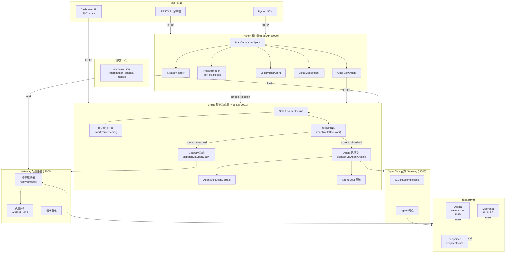
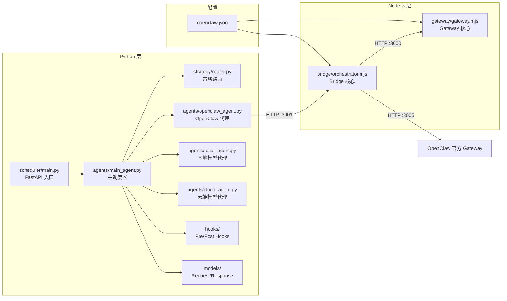
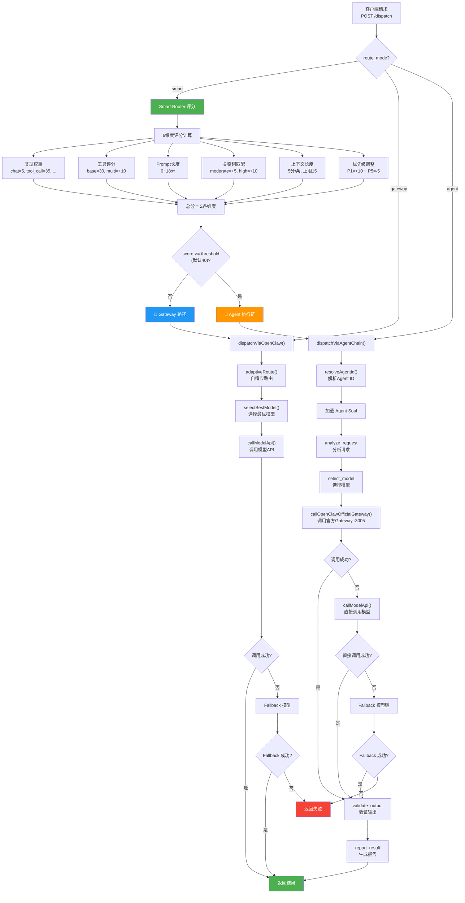
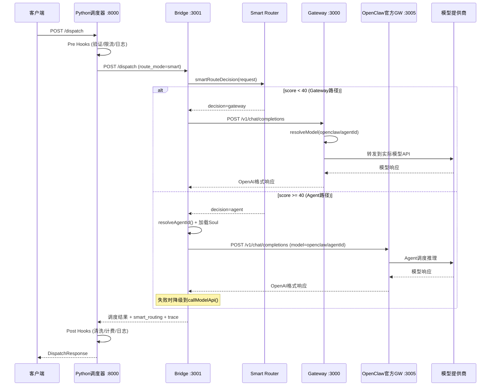
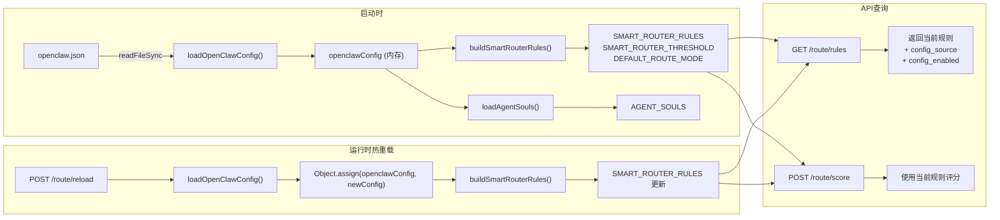

# OpenClaw Multi-Agent 智能调度系统 — 技术说明文档

> 版本: 2026.5.28 | 基于 OpenClaw 2026.4.27

---

## 目录

1. [整体架构](#1-整体架构)
2. [模块调用关系](#2-模块调用关系)
3. [详细设计](#3-详细设计)
4. [上下游输入与输出](#4-上下游输入与输出)
5. [整体数据流图](#5-整体数据流图)
6. [可扩展性](#6-可扩展性)

---

## 1. 整体架构

### 1.1 系统总览

OpenClaw Multi-Agent 智能调度系统采用**四层架构**设计，通过 Smart Router 实现请求复杂度感知的自动路由，在低延迟（Gateway 直连）与高能力（Agent 执行链）之间取得最优平衡。

```
┌─────────────────────────────────────────────────────────────────┐
│                        客户端层 (Client)                         │
│   Dashboard UI  │  curl/API  │  Python SDK  │  第三方集成       │
└───────────────┬───────────────────────────────┬─────────────────┘
                │                               │
                ▼                               ▼
┌───────────────────────────┐   ┌───────────────────────────────────┐
│   Python 调度器 (FastAPI)  │   │     Bridge 智能路由层 (Node.js)    │
│   Port: 8000              │   │   Port: 3001                      │
│   ┌─────────────────────┐ │   │   ┌─────────────────────────────┐ │
│   │ MainDispatcherAgent │ │   │   │     Smart Router Engine     │ │
│   │ StrategyRouter      │ │   │   │  ┌───────┐  ┌───────────┐  │ │
│   │ HookManager         │ │   │   │  │评分器  │  │ 决策器     │  │ │
│   │ OpenClawAgent       │───►   │  └───────┘  └───────────┘  │ │
│   └─────────────────────┘ │   │   └─────────────────────────────┘ │
└───────────────────────────┘   └──────┬──────────────┬────────────┘
                                       │              │
                          ┌────────────┘              └────────────┐
                          ▼                                        ▼
              ┌──────────────────────┐              ┌──────────────────────────┐
              │  Gateway 轻量路由     │              │  OpenClaw Agent 执行链   │
              │  Port: 3000          │              │  Port: 3005              │
              │  (低延迟直连)         │              │  (Agent Soul + 工具调用)  │
              └──────────┬───────────┘              └──────────┬───────────────┘
                         │                                     │
              ┌──────────▼───────────┐              ┌──────────▼───────────────┐
              │  模型提供商           │              │  模型提供商               │
              │  Ollama / Moonshot / │              │  Ollama / Moonshot /     │
              │  DeepSeek            │              │  DeepSeek                │
              └──────────────────────┘              └──────────────────────────┘
```

### 1.2 架构图 (Mermaid)



### 1.3 核心设计原则

| 原则 | 说明 |
|------|------|
| **复杂度感知路由** | Smart Router 通过 6 维度评分自动选择 Gateway（快）或 Agent（强）路径 |
| **配置驱动** | 所有路由规则、阈值、Agent Soul 从 `openclaw.json` 加载，支持热重载 |
| **优雅降级** | Agent 执行链失败时自动回退到 Gateway 直连；Gateway 失败时回退到直接调厂商 API |
| **可观测性** | 每次请求附带完整 trace 链、评分明细、执行步骤和耗时统计 |

---

## 2. 模块调用关系

### 2.1 模块依赖图 (Mermaid)



### 2.2 模块职责表

| 模块 | 文件 | 端口 | 职责 |
|------|------|------|------|
| **Python 调度器** | `scheduler/main.py` | 8000 | FastAPI 入口，Hook 管理，模型注册，服务生命周期 |
| **主调度 Agent** | `scheduler/agents/main_agent.py` | — | 统一调度入口，策略路由，Fallback 管理 |
| **OpenClaw Agent** | `scheduler/agents/openclaw_agent.py` | — | 通过 Bridge 调度，失败回退直连 |
| **策略路由器** | `scheduler/strategy/router.py` | — | 优先级/约束/自适应路由决策 |
| **Bridge 核心** | `bridge/orchestrator.mjs` | 3001 | Smart Router + 双路径调度 + Agent Soul |
| **Gateway 核心** | `gateway/gateway.mjs` | 3000 | 模型解析、代理映射、请求转发 |
| **Dashboard** | `static/dashboard.html` | 3001/8000 | 前端交互界面 |

---

## 3. 详细设计

### 3.1 Smart Router 引擎

Smart Router 是 Bridge 的核心决策模块，负责根据请求复杂度自动选择 Gateway 路径（低延迟）或 Agent 执行链路径（高能力）。

#### 3.1.1 六维度评分模型

```
总分 = Σ(类型权重, 工具评分, Prompt长度评分, 关键词评分, 上下文评分, 优先级调整)
总分 ∈ [0, 100]
```

| 维度 | 评分规则 | 分值范围 | 配置键 |
|------|---------|---------|--------|
| **请求类型权重** | `chat=5, completion=5, tool_call=35, code_execution=40, image=25, audio=25, analysis=20, translation=10` | 5~40 | `typeWeights` |
| **工具调用** | 有工具 +30，多工具额外 +10/个 | 0~40 | `toolCallBase` + `multiToolBonus` |
| **Prompt 长度** | ≤50=0, ≤200=3, ≤500=8, ≤1000=12, >1000=18 | 0~18 | `promptLengthThresholds` |
| **复杂度关键词** | 中等词(分析/比较/设计...) = +5/个，高词(多步骤/自主/编排...) = +10/个 | 0~∞ | `complexityKeywords` |
| **上下文长度** | 每条消息 +5，上限 15 | 0~15 | `contextWeight` + `contextMaxScore` |
| **优先级调整** | P1=+10, P2=+5, P3=0, P4=-3, P5=-5 | -5~+10 | `priorityBoost` |

#### 3.1.2 路由决策逻辑

```
if 总分 >= 阈值(默认40):
    → Agent 执行链 (dispatchViaAgentChain)
else:
    → Gateway 轻量路由 (dispatchViaOpenClaw)
```

**决策原因生成规则：**

| 条件 | Gateway 原因 | Agent 原因 |
|------|-------------|-----------|
| score < 10 | "simple request, gateway sufficient" | — |
| 10 ≤ score < threshold | "below agent threshold, gateway for low latency" | — |
| score ≥ threshold | — | 列出触发因素（工具/类型/关键词/长度/上下文） |

#### 3.1.3 配置驱动架构

Smart Router 的所有规则从 `openclaw.json` 的 `models.smartRouter` 节加载：

```json
{
  "models": {
    "smartRouter": {
      "enabled": true,
      "threshold": 40,
      "defaultMode": "smart",
      "rules": {
        "typeWeights": { ... },
        "toolCallBase": 30,
        "multiToolBonus": 10,
        "promptLengthThresholds": [ ... ],
        "complexityKeywords": { "moderate": [...], "high": [...] },
        "contextWeight": 5,
        "contextMaxScore": 15,
        "priorityBoost": { "1": 10, "2": 5, "3": 0, "4": -3, "5": -5 }
      }
    }
  }
}
```

**加载流程：**

```
openclaw.json → loadOpenClawConfig() → buildSmartRouterRules()
                                         ↓
                                    合并默认值 + 配置值
                                         ↓
                                    SMART_ROUTER_RULES (运行时)
```

**热重载机制：** 调用 `POST /route/reload` 可在不重启服务的情况下重新加载配置。

#### 3.1.4 评分示例

| 请求 | 类型 | Prompt | 工具 | 评分明细 | 总分 | 路由 |
|------|------|--------|------|---------|------|------|
| "1+1=?" | chat | len=5 | 无 | type=+5, tools=+0, len=+0, kw=+0, ctx=+0, prio=+0 | **5** | 🌉 Gateway |
| "请分析市场趋势" | chat | len=7 | 无 | type=+5, tools=+0, len=+0, 分析=+5, ctx=+0, prio=+0 | **10** | 🌉 Gateway |
| "查询北京天气" | tool_call | len=6 | 1个 | type=+35, tools=+30, len=+0, kw=+0, ctx=+0, prio=+0 | **65** | 🤖 Agent |
| "Write sort script" | code_execution | len=36 | 无 | type=+40, tools=+0, len=+0, kw=+0, ctx=+0, prio=+0 | **40** | 🤖 Agent |
| "多步骤自主执行计划" | chat | len=10 | 无 | type=+5, tools=+0, len=+0, 设计+优化+多步骤+自主+执行计划=+50, ctx=+0, prio=+5 | **60** | 🤖 Agent |

### 3.2 Gateway 轻量路由

Gateway（端口 3000）是低延迟路径的核心，负责将 `openclaw/<agentId>` 格式的模型名解析为实际模型端点并转发请求。

#### 3.2.1 模型解析流程

```
请求 model="openclaw/cloud-dispatcher"
    → AGENT_MAP["cloud-dispatcher"].model.primary = "moonshot/kimi-k2.6"
    → MODEL_CATALOG["moonshot/kimi-k2.6"] = { baseUrl, apiKey, modelId }
    → 转发到 https://api.moonshot.cn/v1/chat/completions
```

#### 3.2.2 代理映射表

| 逻辑模型名 | Agent ID | 实际模型 | 提供商 |
|-----------|----------|---------|--------|
| `openclaw/local-dispatcher` | local-dispatcher | ollama/qwen2.5:3b | Ollama (本地) |
| `openclaw/cloud-dispatcher` | cloud-dispatcher | moonshot/kimi-k2.6 | Moonshot (云端) |
| `openclaw/code-executor` | code-executor | deepseek/deepseek-chat | DeepSeek (云端) |
| `openclaw/main` | main | ollama/qwen2.5:3b | Ollama (本地) |

### 3.3 Agent 执行链

Agent 执行链是高能力路径，通过 OpenClaw 官方 Gateway（端口 3005）执行，支持 Agent Soul、工具调用和多步骤推理。

#### 3.3.1 Agent Soul 系统

每个 Agent 拥有独立的 Soul，定义其人格、能力和执行计划：

```json
{
  "id": "cloud-dispatcher",
  "soul": {
    "name": "Cloud Dispatcher",
    "personality": "全面、强大、能力优先",
    "capabilities": ["云端模型调度", "工具调用", "多步推理", "长上下文处理"],
    "executionSteps": ["analyze_request", "select_model", "execute_inference", "validate_output", "report_result"]
  }
}
```

#### 3.3.2 执行上下文 (AgentExecutionContext)

每次 Agent 执行创建独立的执行上下文，记录完整的执行轨迹：

```
AgentExecutionContext
├── agentId: "cloud-dispatcher"
├── soul: Agent Soul 引用
├── trace: [{ agent, message, timestamp, elapsed }]
├── steps: [{ step, status, startTime, endTime, duration, result }]
└── status: "initialized" → "completed" | "failed"
```

#### 3.3.3 执行步骤

| 步骤 | 说明 | 输出 |
|------|------|------|
| `analyze_request` | 分析请求类型和复杂度 | `{ type, complexity, requires_tools, recommendedModel }` |
| `select_model` | 基于 Soul 和分析选择模型 | `{ endpoint, fallbacks, reason }` |
| `execute_inference` | 通过 OpenClaw 官方 Gateway 执行推理 | `{ output, usage, latency_ms, tool_calls }` |
| `validate_output` | 验证输出质量 | `{ quality, isComplete, outputLength }` |
| `report_result` | 生成执行报告 | `{ steps_completed, total_duration_ms }` |

#### 3.3.4 降级策略

```
OpenClaw 官方 Gateway (:3005)
    ↓ 失败
直接调用模型 API (callModelApi)
    ↓ 失败
Fallback 模型链 (最多 2 个)
    ↓ 全部失败
返回 ALL_MODELS_FAILED 错误
```

### 3.4 Python 调度器

Python 调度器（FastAPI :8000）是系统的入口服务，负责请求预处理、Hook 管理和统一调度。

#### 3.4.1 Hook 系统

| 阶段 | Hook | 功能 |
|------|------|------|
| **Pre** | `RequestValidationHook` | 请求参数校验 |
| **Pre** | `ConstraintEnrichmentHook` | 约束条件补充 |
| **Pre** | `RateLimitHook` | 速率限制 |
| **Pre** | `RequestLoggingHook` | 请求日志 |
| **Post** | `ResponseSanitizationHook` | 响应清洗 |
| **Post** | `CostCalculationHook` | 成本计算 |
| **Post** | `RetryDecisionHook` | 重试决策 |
| **Post** | `ResponseLoggingHook` | 响应日志 |

#### 3.4.2 调度流程

```
请求 → Pre Hooks → StrategyRouter.route()
                    ├── OpenClaw 可用 → OpenClawAgent → Bridge /dispatch
                    └── OpenClaw 不可用 → LocalAgent / CloudAgent → 直连模型
        → Post Hooks → 响应
```

---

## 4. 上下游输入与输出

### 4.1 Bridge API 接口规范

#### 4.1.1 POST /dispatch — 智能调度

**请求：**

```json
{
  "appid": "string",
  "type": "chat | completion | tool_call | code_execution | image | audio | analysis | translation",
  "prompt": "string",
  "priority": 1-5,
  "route_mode": "smart | gateway | agent",
  "tools": [{ "type": "function", "function": { "name": "...", "parameters": {} } }],
  "tool_choice": "auto | none | { type: 'function', function: { name: '...' } }",
  "context": [{ "role": "user|assistant|system", "content": "..." }],
  "constraints": { "require_local": true, "max_latency_ms": 3000, "preferred_providers": ["ollama"] },
  "parameters": { "temperature": 0.7, "top_p": 0.9 },
  "agent_id": "string",
  "api_key": "string",
  "timeout_ms": 30000,
  "model_hint": "string"
}
```

**响应（Smart 模式成功）：**

```json
{
  "request_id": "uuid",
  "appid": "string",
  "status": "success",
  "result": {
    "model_name": "ollama/qwen2.5:3b",
    "model_type": "local",
    "provider": "ollama",
    "output": "string",
    "usage": { "prompt_tokens": 10, "completion_tokens": 20, "total_tokens": 30 },
    "latency_ms": 326,
    "cost": 0,
    "finish_reason": "stop",
    "routed_via_gateway": true,
    "actual_model": "qwen2.5:3b"
  },
  "smart_routing": {
    "mode": "smart",
    "decision": "gateway | agent",
    "score": 5,
    "threshold": 40,
    "breakdown": "type=chat → +5 | no tools → +0 | len=5 → +0 | ...",
    "reason": "simple request, gateway sufficient",
    "estimated_latency": "300-800ms"
  },
  "agent_trace": [{ "agent": "openclaw_router", "message": "..." }],
  "strategy_name": "adaptive_local_first",
  "routing_decision": { ... }
}
```

**响应（Agent 链路模式）：**

```json
{
  "status": "success",
  "result": { ... },
  "agent_trace": [
    { "agent": "agent_router", "message": "Agent chain mode: routing to agent=cloud-dispatcher" },
    { "agent": "agent_soul", "message": "Loaded soul: Cloud Dispatcher (全面、强大、能力优先)" },
    { "agent": "agent_analyzer", "message": "Request analysis: type=tool_call, complexity=complex" },
    { "agent": "agent_selector", "message": "Model selected: moonshot/kimi-k2.6" },
    { "agent": "agent_executor", "message": "OpenClaw Gateway inference completed" },
    { "agent": "agent_validator", "message": "Output validation: quality=good" }
  ],
  "execution_context": {
    "agent_id": "cloud-dispatcher",
    "soul_name": "Cloud Dispatcher",
    "steps_completed": 5,
    "steps_total": 5,
    "total_duration_ms": 47290
  }
}
```

#### 4.1.2 POST /route/score — 评分预览

**请求：** 同 /dispatch 的 body

**响应：**

```json
{
  "score": 65,
  "threshold": 40,
  "decision": "agent",
  "scores": {
    "type": { "value": 35, "detail": "type=tool_call → +35" },
    "tools": { "value": 30, "detail": "1 tool(s) → +30" },
    "promptLength": { "value": 0, "detail": "len=6 → +0" },
    "keywords": { "value": 0, "detail": "no keywords → +0" },
    "context": { "value": 0, "detail": "0 messages → +0" },
    "priority": { "value": 0, "detail": "priority=3 → +0" }
  },
  "breakdown": "type=tool_call → +35 | 1 tool(s) → +30 | len=6 → +0 | ...",
  "reason": "requires tool execution, complex type (tool_call)",
  "estimatedLatency": "3-60s"
}
```

#### 4.1.3 GET /route/rules — 查看路由规则

**响应：**

```json
{
  "threshold": 40,
  "rules": { ... },
  "default_mode": "smart",
  "config_source": "openclaw.json",
  "config_enabled": true
}
```

#### 4.1.4 POST /route/mode — 切换路由模式

**请求：** `{ "mode": "smart | gateway | agent" }`

#### 4.1.5 POST /route/reload — 热重载配置

**响应：**

```json
{
  "reloaded": true,
  "threshold": 40,
  "default_mode": "smart",
  "config_source": "openclaw.json",
  "config_enabled": true
}
```

#### 4.1.6 其他端点

| 方法 | 路径 | 说明 |
|------|------|------|
| GET | `/health` | 健康检查（含 Gateway 可达性） |
| GET | `/models` | 模型列表（含状态） |
| GET | `/agents` | Agent 列表 |
| GET | `/agents/souls` | Agent Soul 详情 |
| GET | `/routing/config` | 路由配置 |
| GET | `/stats` | 统计信息 |
| POST | `/agent/message` | 直接向 Agent 发消息 |

### 4.2 Python 调度器 API 接口规范

| 方法 | 路径 | 说明 |
|------|------|------|
| POST | `/dispatch` | 调度请求 |
| POST | `/dispatch/batch` | 批量调度 |
| GET | `/models` | 模型列表 |
| POST | `/models` | 注册模型 |
| DELETE | `/models/{name}` | 注销模型 |
| GET | `/models/{name}/status` | 模型状态 |
| GET | `/hooks` | Hook 列表 |
| POST | `/hooks/{name}/enable` | 启用 Hook |
| POST | `/hooks/{name}/disable` | 禁用 Hook |
| GET | `/stats` | 统计信息 |
| GET | `/history` | 调度历史 |
| GET | `/health` | 健康检查 |
| GET | `/openclaw/bridge/health` | Bridge 健康检查 |
| GET | `/openclaw/bridge/models` | Bridge 模型列表 |
| GET | `/openclaw/bridge/stats` | Bridge 统计 |
| POST | `/openclaw/agent/{agent_id}/message` | Agent 消息 |
| GET | `/openclaw/adaptive/state` | 自适应状态 |
| POST | `/openclaw/toggle` | 开关 OpenClaw |

---

## 5. 整体数据流图

### 5.1 Smart Router 决策流程图 (Mermaid)



### 5.2 端到端数据流图 (Mermaid)



### 5.3 配置加载与热重载流程 (Mermaid)



---

## 6. 可扩展性

### 6.1 水平扩展

| 组件 | 扩展方式 | 说明 |
|------|---------|------|
| **Bridge** | 多实例 + 负载均衡 | 无状态设计，可水平扩展 |
| **Gateway** | 多实例 + Nginx | 请求日志可外置到 Redis |
| **OpenClaw 官方 GW** | 集群模式 | OpenClaw 原生支持 |
| **模型提供商** | 动态注册 | 通过 `POST /models` 热添加 |

### 6.2 垂直扩展

| 扩展点 | 方式 | 配置/代码位置 |
|--------|------|-------------|
| **新增模型** | 在 `openclaw.json` 的 `models.catalog` 中添加 | `openclaw.json` |
| **新增 Agent** | 在 `openclaw.json` 的 `agents.list` 中添加，自动生成 Soul | `openclaw.json` + `buildAgentSoul()` |
| **调整路由阈值** | 修改 `smartRouter.threshold`，调用 `/route/reload` | `openclaw.json` |
| **新增评分维度** | 在 `smartRouterScore()` 中添加新维度计算 | `orchestrator.mjs` |
| **新增关键词** | 在 `complexityKeywords.moderate/high` 中添加 | `openclaw.json` |
| **新增 Hook** | 实现 `BasePreHook` / `BasePostHook` 并注册 | `scheduler/hooks/` |
| **新增路由策略** | 在 `StrategyRouter` 中添加策略 | `scheduler/strategy/router.py` |

### 6.3 未来扩展方向

#### 6.3.1 自适应阈值

当前阈值固定为 40，可扩展为根据系统负载动态调整：

```
threshold = base_threshold + load_adjustment
load_adjustment = f(cpu_usage, queue_depth, avg_latency)
```

当系统负载高时提高阈值（更多请求走快速 Gateway），负载低时降低阈值（更多请求走 Agent 获得更高质量）。

#### 6.3.2 ML 驱动的评分权重

当前评分权重为人工设定，可扩展为基于历史数据的机器学习模型：

```
score = ML_model(request_features)
features = [type_encoded, tool_count, prompt_length, keyword_count, context_size, priority]
```

训练数据来源：历史请求的评分 vs 实际执行结果（质量、延迟、成本）。

#### 6.3.3 A/B 测试框架

对同一请求同时走两条路径，比较结果质量和延迟，用于优化评分权重：

```
request → [Gateway路径] → result_A
       → [Agent路径]  → result_B
compare(result_A, result_B) → 更新权重
```

#### 6.3.4 多租户隔离

在 `openclaw.json` 中按 `appid` 配置独立的 Smart Router 规则：

```json
{
  "models": {
    "smartRouter": {
      "tenants": {
        "app-A": { "threshold": 30, "rules": { ... } },
        "app-B": { "threshold": 50, "rules": { ... } }
      }
    }
  }
}
```

#### 6.3.5 流量灰度

按百分比分配流量到不同路径：

```json
{
  "smartRouter": {
    "trafficSplit": {
      "gateway": 70,
      "agent": 30
    }
  }
}
```

---

## 附录 A: 环境变量

| 变量 | 默认值 | 说明 |
|------|--------|------|
| `BRIDGE_PORT` | 3001 | Bridge 监听端口 |
| `OPENCLAW_GATEWAY_URL` | http://localhost:3000 | 自定义 Gateway 地址 |
| `OPENCLAW_OFFICIAL_GATEWAY_URL` | http://127.0.0.1:3005 | OpenClaw 官方 Gateway 地址 |
| `USE_OPENCLAW_GATEWAY` | true | 是否通过 Gateway 路由 |
| `DEFAULT_ROUTE_MODE` | smart | 默认路由模式 (smart/gateway/agent) |
| `SMART_ROUTER_THRESHOLD` | 40 | Smart Router 阈值（可被配置文件覆盖） |
| `AGENT_EXECUTION_TIMEOUT` | 120000 | Agent 执行超时 (ms) |
| `MOONSHOT_API_KEY` | — | Moonshot API 密钥 |
| `DEEPSEEK_API_KEY` | — | DeepSeek API 密钥 |
| `OPENCLAW_TOKEN` | — | OpenClaw 官方 Gateway 认证令牌 |

## 附录 B: 端口分配

| 端口 | 服务 | 协议 |
|------|------|------|
| 3000 | OpenClaw Gateway (自定义) | HTTP |
| 3001 | Bridge 智能路由 | HTTP |
| 3005 | OpenClaw 官方 Gateway | HTTP |
| 8000 | Python 调度器 (FastAPI) | HTTP |
| 11434 | Ollama 本地模型服务 | HTTP |

## 附录 C: 性能基准

| 场景 | 路径 | 典型延迟 | 说明 |
|------|------|---------|------|
| 简单对话 (1+1=?) | Smart → Gateway | ~300ms | 本地 Ollama 推理 |
| 中等对话 (分析趋势) | Smart → Gateway | ~5s | 本地模型长输出 |
| 工具调用 (查天气) | Smart → Agent | ~47s | OpenClaw GW + 云端模型 |
| 代码执行 | Smart → Agent | ~47s | OpenClaw GW + Agent Soul |
| 复杂任务 (多步骤) | Smart → Agent | ~55s | OpenClaw GW + 长上下文 |
