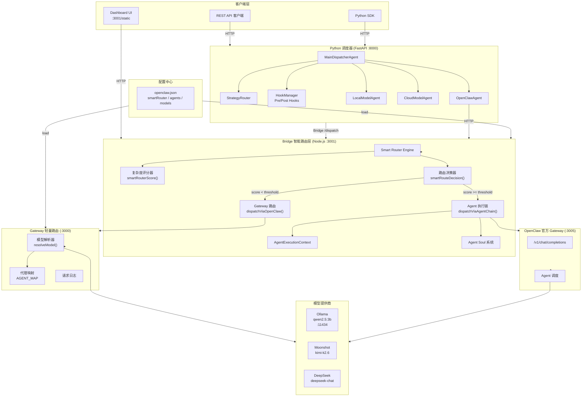
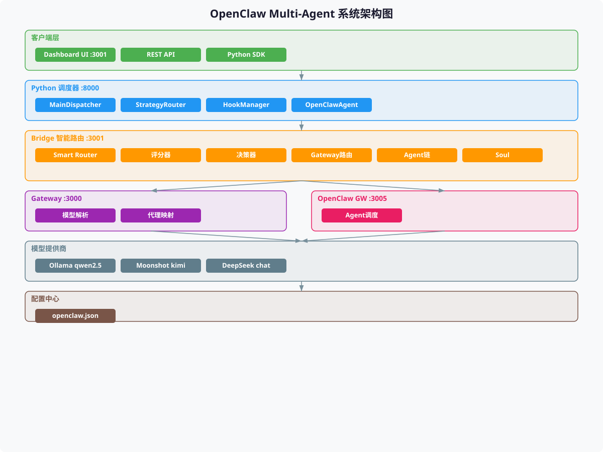
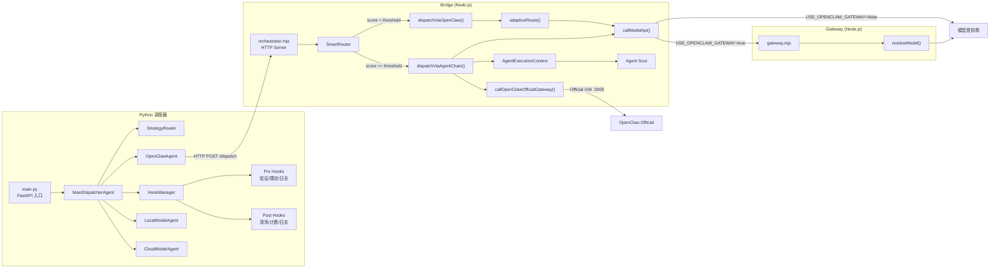
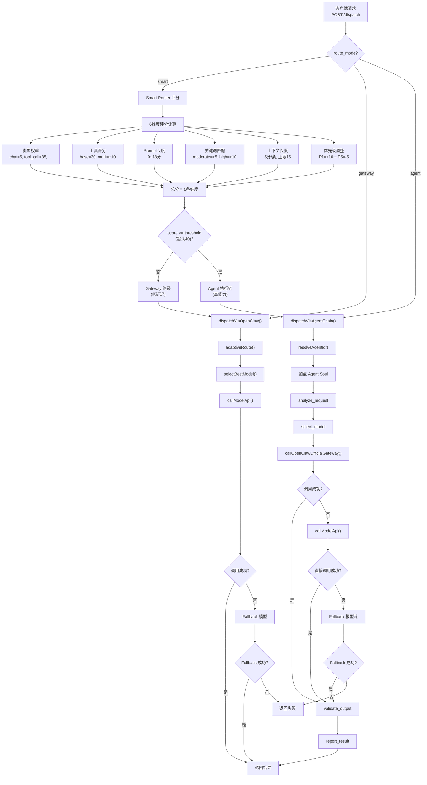
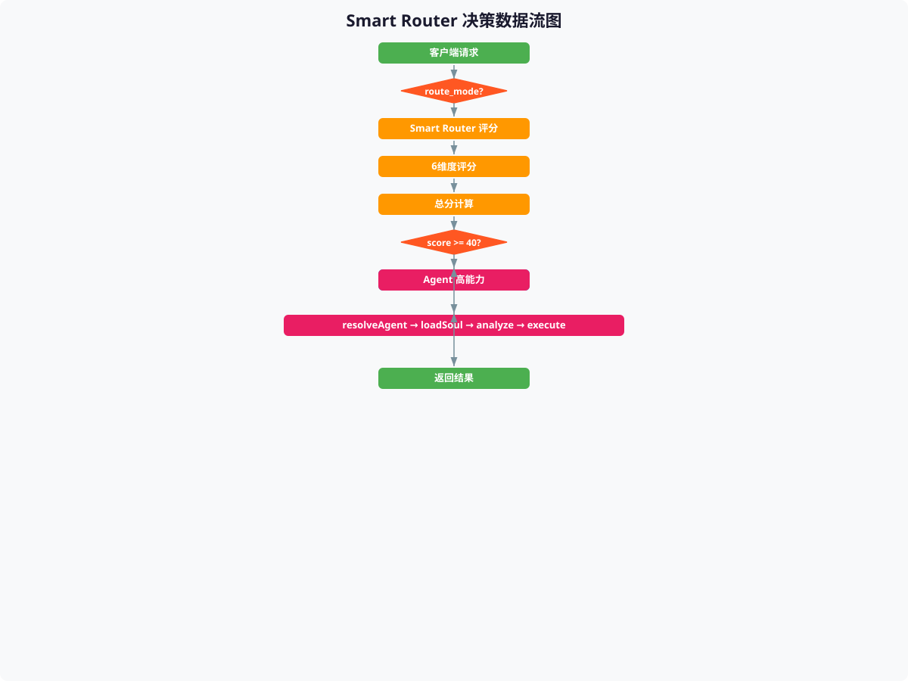
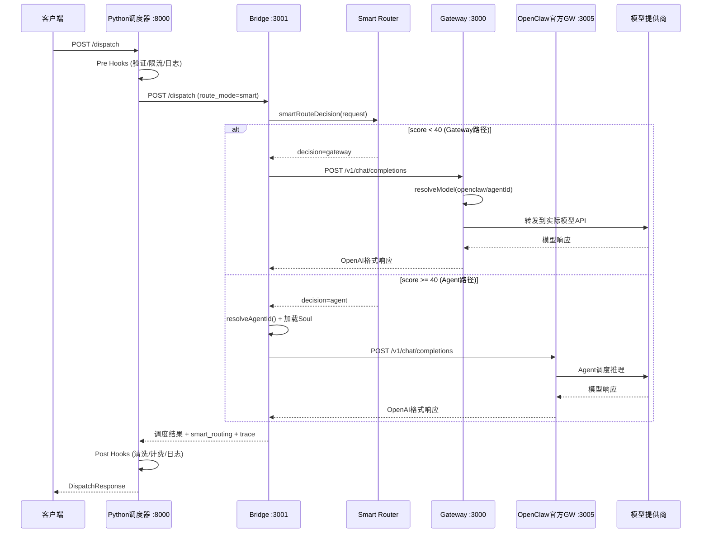
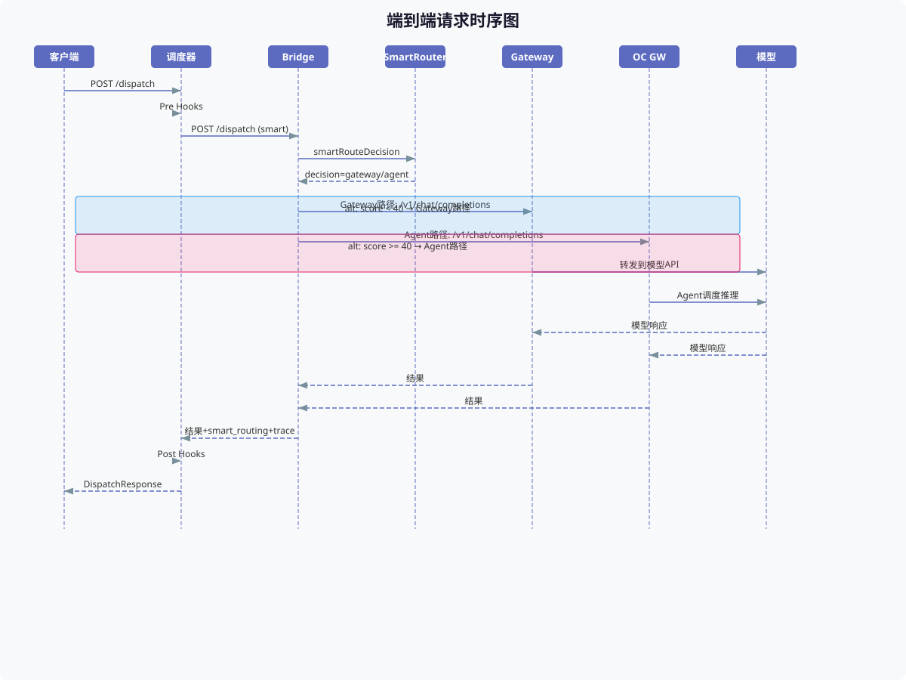
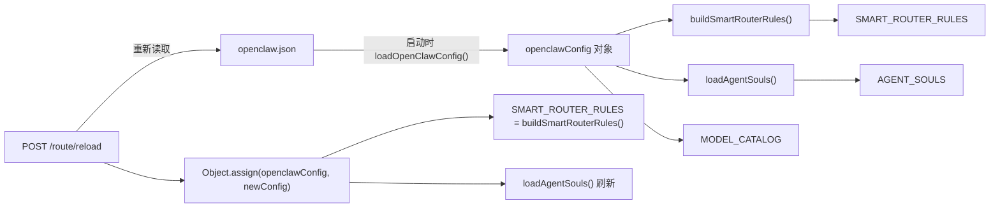

# OpenClaw Multi-Agent 智能调度系统 — 技术说明文档 v3

> 版本: 3.0 | 更新日期: 2026-05-28 | 基于 Smart Router 双路径架构

---

## 目录

1. [整体架构](#1-整体架构)
2. [模块调用关系](#2-模块调用关系)
3. [详细设计](#3-详细设计)
4. [上下游输入与输出](#4-上下游输入与输出)
5. [整体数据流图](#5-整体数据流图)
6. [可扩展性](#6-可扩展性)

---

## 1. 整体架构

### 1.1 架构总览

OpenClaw Multi-Agent 系统采用 **四层分离 + 双路径路由** 的架构设计：

| 层级 | 组件 | 端口 | 技术栈 | 职责 |
|------|------|------|--------|------|
| 客户端层 | Dashboard UI / REST API / SDK | :3001/static | HTML/JS | 请求提交、结果展示、路由可视化 |
| Python 调度层 | FastAPI Scheduler | :8000 | Python/FastAPI | 请求验证、Hook处理、策略路由、Agent调度 |
| Bridge 智能路由层 | Node.js Bridge | :3001 | Node.js | Smart Router 评分、双路径分发、Agent Soul 管理 |
| Gateway 路由层 | Custom GW / OpenClaw Official GW | :3000 / :3005 | Node.js | 模型解析、代理映射、请求转发 |
| 模型提供层 | Ollama / Moonshot / DeepSeek | :11434 / Cloud | 各厂商SDK | 实际推理执行 |

### 1.2 架构图 (Mermaid)



### 1.3 架构图 (SVG)



### 1.4 双路径路由核心思想

系统根据请求复杂度自动选择两条处理路径：

| 路径 | 条件 | 延迟 | 能力 | 适用场景 |
|------|------|------|------|----------|
| **Gateway 路径** | score < 40 | 300ms~800ms | 轻量转发 | 简单对话、短文本补全 |
| **Agent 执行链** | score ≥ 40 | 3s~60s | Agent Soul + 多步推理 | 工具调用、多步编排、复杂分析 |

---

## 2. 模块调用关系

### 2.1 模块依赖图 (Mermaid)



### 2.2 模块职责详表

| 模块 | 文件 | 核心职责 |
|------|------|----------|
| **FastAPI 入口** | `scheduler/main.py` | 服务启动、模型注册、Bridge/Gateway 进程管理、API 端点 |
| **MainDispatcherAgent** | `scheduler/agents/main_agent.py` | 请求调度总控、Hook执行、策略路由、Fallback处理 |
| **StrategyRouter** | `scheduler/strategy/router.py` | 端点选择策略（adaptive/priority/capability） |
| **HookManager** | `scheduler/hooks/hook_manager.py` | Pre/Post Hook 链式执行 |
| **OpenClawAgent** | `scheduler/agents/openclaw_agent.py` | Bridge 代理，将请求转发至 Bridge |
| **LocalModelAgent** | `scheduler/agents/local_agent.py` | 本地模型直接调用 |
| **CloudModelAgent** | `scheduler/agents/cloud_agent.py` | 云端模型直接调用 |
| **Bridge Orchestrator** | `bridge/orchestrator.mjs` | HTTP Server、Smart Router、双路径分发、Agent Soul |
| **Gateway** | `gateway/gateway.mjs` | 模型解析、代理映射、请求转发、日志记录 |
| **Dashboard** | `static/dashboard.html` | 前端界面、路由模式选择、评分可视化 |
| **配置中心** | `openclaw.json` | Smart Router 规则、Agent 列表、模型目录、路由策略 |

---

## 3. 详细设计

### 3.1 Smart Router 引擎

Smart Router 是 Bridge 的核心决策引擎，基于 **六维复杂度评分模型** 自动选择最优路由路径。

#### 3.1.1 评分维度

| 维度 | 权重/规则 | 分值范围 | 说明 |
|------|-----------|----------|------|
| **请求类型** (typeWeights) | chat=5, completion=5, tool_call=35, code_execution=40, image=25, audio=25, analysis=20, translation=10 | 5~40 | 不同请求类型固有复杂度 |
| **工具调用** (toolCallBase + multiToolBonus) | 有工具=+30, 多工具=+10 | 0~40 | 工具调用需要 Agent 执行链 |
| **Prompt 长度** (promptLengthThresholds) | ≤50→0, ≤200→3, ≤500→8, ≤1000→12, >1000→18 | 0~18 | 长 Prompt 需要更强推理能力 |
| **复杂度关键词** (complexityKeywords) | moderate=+5/词, high=+10/词 | 0~∞ | "分析""多步骤""编排"等关键词 |
| **上下文长度** (contextWeight × count) | 5分/条, 上限15 | 0~15 | 多轮对话增加复杂度 |
| **优先级调整** (priorityBoost) | P1=+10, P2=+5, P3=0, P4=-3, P5=-5 | -5~+10 | 高优先级倾向 Agent 链路 |

#### 3.1.2 评分算法

```javascript
function smartRouterScore(request) {
  const type = request.type || "chat";
  const prompt = request.prompt || "";
  const tools = request.tools || [];
  const context = request.context || [];
  const priority = request.priority || 3;

  let total = 0;

  // 维度1: 请求类型权重
  total += SMART_ROUTER_RULES.typeWeights[type] ?? 5;

  // 维度2: 工具调用评分
  if (tools.length > 0) {
    total += SMART_ROUTER_RULES.toolCallBase;  // +30
    if (tools.length > 1) total += SMART_ROUTER_RULES.multiToolBonus;  // +10
  }

  // 维度3: Prompt 长度评分 (阶梯式)
  for (const t of SMART_ROUTER_RULES.promptLengthThresholds) {
    if (prompt.length <= t.max) { total += t.score; break; }
  }

  // 维度4: 关键词匹配
  for (const kw of SMART_ROUTER_RULES.complexityKeywords.moderate) {
    if (prompt.includes(kw)) total += 5;
  }
  for (const kw of SMART_ROUTER_RULES.complexityKeywords.high) {
    if (prompt.includes(kw)) total += 10;
  }

  // 维度5: 上下文长度
  total += Math.min(context.length * SMART_ROUTER_RULES.contextWeight,
                     SMART_ROUTER_RULES.contextMaxScore);

  // 维度6: 优先级调整
  total += SMART_ROUTER_RULES.priorityBoost[priority] ?? 0;

  // 钳位到 [0, 100]
  return Math.max(0, Math.min(100, total));
}
```

#### 3.1.3 路由决策

```javascript
function smartRouteDecision(request) {
  const { total, scores, breakdown } = smartRouterScore(request);
  const threshold = SMART_ROUTER_THRESHOLD;  // 默认 40
  const decision = total >= threshold ? "agent" : "gateway";

  return {
    score: total,
    threshold,
    decision,          // "gateway" | "agent"
    scores,            // 各维度明细
    breakdown,         // 文字化评分明细
    reason,            // 决策原因
    estimated_latency, // 预估延迟
  };
}
```

#### 3.1.4 典型评分示例

| 请求 | 类型 | 工具 | Prompt长度 | 关键词 | 上下文 | 优先级 | 总分 | 路由 |
|------|------|------|-----------|--------|--------|--------|------|------|
| "你好" | chat(5) | 0 | ≤50(0) | 0 | 0条(0) | P3(0) | **5** | Gateway |
| "分析一下这段代码" | chat(5) | 0 | ≤200(3) | 分析(+5) | 0条(0) | P3(0) | **13** | Gateway |
| "帮我执行Python脚本" | chat(5) | 1个(+30) | ≤200(3) | 0 | 2条(10) | P2(+5) | **53** | Agent |
| "多步骤编排任务" | analysis(20) | 2个(+40) | >1000(18) | 多步骤(+10)+编排(+10) | 3条(15) | P1(+10) | **123→100** | Agent |

### 3.2 Agent Soul 系统

Agent Soul 为每个 Agent 定义了人格、能力和执行计划，是 Agent 执行链的核心驱动。

#### 3.2.1 Agent 列表

| Agent ID | 人格 | 主模型 | 能力 | 工具权限 |
|----------|------|--------|------|----------|
| `main` | 通用、灵活、综合 | ollama/qwen2.5:3b | 通用对话、任务分析、智能路由、多Agent协调 | bash, read, write, edit, glob, grep |
| `local-dispatcher` | 高效、精准、低延迟优先 | ollama/qwen2.5:3b | 本地模型调度、低延迟推理、隐私数据处理 | bash, read, write, edit |
| `cloud-dispatcher` | 全面、强大、能力优先 | moonshot/kimi-k2.6 | 云端模型调度、工具调用、多步推理 | bash, read, write, edit, browser |
| `code-executor` | 严谨、精确、代码优先 | deepseek/deepseek-chat | 代码生成、代码调试、技术问题分析 | bash, read, write, edit |

#### 3.2.2 Agent 执行计划

每个 Agent Soul 定义了标准化的五步执行计划：

```
analyze_request → select_model → execute_inference → validate_output → report_result
```

| 步骤 | 描述 | 输出 |
|------|------|------|
| `analyze_request` | 分析请求内容，识别任务类型和复杂度 | `{ type, complexity, requires_tools, recommendedModel }` |
| `select_model` | 根据 Soul 和请求分析选择最优模型 | `{ endpoint, fallbacks, reason }` |
| `execute_inference` | 通过 Gateway 执行模型推理 | `{ output, usage, latency_ms, finish_reason }` |
| `validate_output` | 验证输出质量和完整性 | `{ quality, isComplete, outputLength }` |
| `report_result` | 生成执行报告并返回结果 | `AgentExecutionContext.getSummary()` |

#### 3.2.3 Agent 解析逻辑

```javascript
function resolveAgentId(request) {
  // 1. 显式指定
  if (request.agent_id && AGENT_SOULS[request.agent_id]) return request.agent_id;

  // 2. 按类型推断
  const type = request.type || "chat";
  const hasTools = !!(request.tools && request.tools.length > 0);
  if (type === "tool_call" || hasTools) return "cloud-dispatcher";
  if (type === "chat" || type === "completion") return "local-dispatcher";

  // 3. 默认 Agent
  const defaultAgent = Object.values(AGENT_SOULS).find(a => a.isDefault);
  return defaultAgent?.id || "main";
}
```

### 3.3 Gateway 路由层

#### 3.3.1 Custom Gateway (:3000)

Custom Gateway 负责 Bridge→Gateway 路径的请求转发：

- **模型解析** `resolveModel(modelName)`：将 `openclaw/<agentId>` 映射到实际模型端点
- **代理映射** `AGENT_MAP`：维护 agentId → agent 配置的映射表
- **请求转发**：将 OpenAI 格式请求转发到对应模型提供商
- **请求日志**：记录最近 200 条请求，含状态、延迟、Fallback 信息

**端点映射表**：

| Bridge 端点名 | Gateway 模型名 | 实际模型 |
|---------------|----------------|----------|
| `ollama/qwen2.5:3b` | `openclaw/local-dispatcher` | qwen2.5:3b @ localhost:11434 |
| `moonshot/kimi-k2.6` | `openclaw/cloud-dispatcher` | kimi-k2.6 @ api.moonshot.cn |
| `deepseek/deepseek-chat` | `openclaw/code-executor` | deepseek-chat @ api.deepseek.com |

#### 3.3.2 OpenClaw Official Gateway (:3005)

OpenClaw 官方 Gateway 负责 Agent 执行链的请求调度：

- 接收 `model: "openclaw/<agentId>"` 格式的请求
- 通过 OpenClaw Agent 系统进行推理调度
- 支持 Agent Soul 注入和执行计划管理
- 支持工具调用（tools/tool_choice 参数）

### 3.4 自适应路由策略 (adaptiveRoute)

当走 Gateway 路径时，Bridge 使用自适应路由策略选择最优模型端点：

```
约束检查 → 优先级判断 → 复杂度判断 → 本地优先 → 云端兜底
```

| 策略名 | 条件 | 选择 |
|--------|------|------|
| `adaptive_local_required` | `constraints.require_local=true` | 本地模型 |
| `adaptive_preferred_provider` | `constraints.preferred_providers` | 指定提供商 |
| `adaptive_priority_local_first` | `priority ≤ 2 && localFirst` | 本地优先 |
| `adaptive_complex_cloud_first` | 复杂类型 + `preferCloudForComplex` | 云端优先 |
| `adaptive_local_first` | 默认 + `localFirst` | 本地优先 |
| `adaptive_cloud_only` | 无本地可用 | 云端兜底 |

### 3.5 Hook 系统

Python 调度器的 Hook 系统提供请求/响应的拦截处理：

**Pre Hooks**（请求预处理）：

| Hook | 功能 |
|------|------|
| `RequestValidationHook` | 请求参数验证 |
| `ConstraintEnrichmentHook` | 约束条件补充 |
| `RateLimitHook` | 请求限流 |
| `RequestLoggingHook` | 请求日志记录 |

**Post Hooks**（响应后处理）：

| Hook | 功能 |
|------|------|
| `ResponseSanitizationHook` | 响应内容清洗 |
| `CostCalculationHook` | 成本计算 |
| `ResponseLoggingHook` | 响应日志记录 |
| `RetryDecisionHook` | 重试决策 |

### 3.6 配置驱动架构

所有核心参数均由 `openclaw.json` 配置驱动，支持热重载：

```json
{
  "models": {
    "smartRouter": {
      "enabled": true,
      "threshold": 40,
      "defaultMode": "smart",
      "rules": { ... }
    },
    "routing": {
      "defaultStrategy": "adaptive",
      "strategies": { "adaptive": { ... } }
    },
    "catalog": { "local": [...], "cloud": [...] }
  },
  "agents": {
    "defaults": { ... },
    "list": [ ... ]
  },
  "gateway": { "port": 3000, "host": "0.0.0.0" }
}
```

**热重载端点**：`POST /route/reload`

---

## 4. 上下游输入与输出

### 4.1 Bridge API 接口

#### 4.1.1 POST /dispatch — 核心调度接口

**请求体**：

```json
{
  "request_id": "string (可选)",
  "appid": "string (可选)",
  "type": "chat | completion | tool_call | code_execution | image | audio | analysis | translation",
  "prompt": "string (必填)",
  "context": [{ "role": "user|assistant|system", "content": "string" }],
  "tools": [{ "type": "function", "function": { "name": "...", "parameters": {} } }],
  "tool_choice": "auto | none | { type: 'function', function: { name: '...' } }",
  "priority": "1-5 (默认3)",
  "route_mode": "smart | gateway | agent (默认smart)",
  "agent_id": "string (可选, 显式指定Agent)",
  "model_hint": "string (可选, 模型名称提示)",
  "constraints": {
    "require_local": false,
    "preferred_providers": ["ollama", "moonshot"],
    "max_latency_ms": 3000
  },
  "parameters": { "temperature": 0.7, "top_p": 0.9 },
  "timeout_ms": 30000,
  "api_key": "string (可选, 覆盖默认API Key)"
}
```

**响应体（成功）**：

```json
{
  "request_id": "req-xxx",
  "appid": "app-xxx",
  "status": "success",
  "result": {
    "model_name": "moonshot/kimi-k2.6",
    "model_type": "cloud",
    "provider": "moonshot",
    "output": "模型输出内容",
    "usage": { "prompt_tokens": 100, "completion_tokens": 50, "total_tokens": 150 },
    "latency_ms": 1200,
    "cost": 0.000228,
    "finish_reason": "stop",
    "routed_via_gateway": true,
    "actual_model": "kimi-k2.6"
  },
  "fallback_results": null,
  "agent_trace": [
    { "agent": "openclaw_router", "message": "Routed to moonshot/kimi-k2.6 via adaptive_complex_cloud_first" },
    { "agent": "openclaw_gateway", "message": "Forwarding to OpenClaw Gateway at http://localhost:3000/v1/chat/completions" }
  ],
  "strategy_name": "adaptive_complex_cloud_first",
  "routing_decision": { ... },
  "smart_routing": {
    "mode": "smart",
    "decision": "gateway",
    "score": 25,
    "threshold": 40,
    "breakdown": "type=chat → +5 | no tools → +0 | len=80 → +3 | no keywords → +0 | 2 messages → +10 | priority=3 → +0",
    "reason": "below agent threshold, gateway for low latency",
    "estimated_latency": "300-800ms"
  }
}
```

**响应体（Agent 执行链）**：

```json
{
  "request_id": "req-xxx",
  "status": "success",
  "result": { ... },
  "agent_trace": [
    { "agent": "agent_router", "message": "Agent chain mode: routing to agent=cloud-dispatcher" },
    { "agent": "agent_soul", "message": "Loaded soul: Cloud Dispatcher (全面、强大、能力优先)" },
    { "agent": "agent_analyzer", "message": "Request analysis: type=tool_call, complexity=complex" },
    { "agent": "agent_selector", "message": "Model selected: moonshot/kimi-k2.6" },
    { "agent": "agent_executor", "message": "OpenClaw Gateway inference completed" },
    { "agent": "agent_validator", "message": "Output validation: quality=good" },
    { "agent": "agent_report", "message": "Execution complete: 5/5 steps" }
  ],
  "execution_context": {
    "agent_id": "cloud-dispatcher",
    "soul_name": "Cloud Dispatcher",
    "status": "completed",
    "total_duration_ms": 8500,
    "steps_completed": 5,
    "steps_total": 5,
    "steps": [
      { "step": "analyze_request", "status": "completed", "duration_ms": 2 },
      { "step": "select_model", "status": "completed", "duration_ms": 1 },
      { "step": "execute_inference", "status": "completed", "duration_ms": 8200 },
      { "step": "validate_output", "status": "completed", "duration_ms": 1 },
      { "step": "report_result", "status": "completed", "duration_ms": 0 }
    ]
  },
  "strategy_name": "agent_chain",
  "routing_decision": {
    "agent_type": "openclaw-agent",
    "selected_endpoint": "openclaw/cloud-dispatcher",
    "openclaw_gateway": "http://127.0.0.1:3005"
  }
}
```

#### 4.1.2 其他 API 端点

| 方法 | 路径 | 功能 | 输入 | 输出 |
|------|------|------|------|------|
| GET | `/health` | 健康检查 | - | `{ status, openclaw_version, bridge_port, gateway_url, official_gateway_reachable, ... }` |
| GET | `/models?type=local\|cloud` | 模型列表 | query: type | `{ models: [{ id, provider, state, ... }] }` |
| GET | `/agents` | Agent 列表 | - | `{ agents: [...] }` |
| GET | `/agents/souls` | Agent Soul 详情 | - | `{ agents: [{ id, soul_name, capabilities, execution_steps, ... }] }` |
| GET | `/routing/config` | 路由配置 | - | `{ defaultStrategy, strategies: {...} }` |
| GET | `/route/rules` | Smart Router 规则 | - | `{ threshold, rules, default_mode, config_source }` |
| GET | `/stats` | 运行统计 | - | `{ total_requests, success_rate, endpoints: {...} }` |
| POST | `/route/mode` | 切换路由模式 | `{ mode: "smart"\|"gateway"\|"agent" }` | `{ mode, message }` |
| POST | `/route/reload` | 热重载配置 | - | `{ reloaded, threshold, default_mode, config_source }` |
| POST | `/route/score` | 计算评分 | DispatchRequest body | `{ score, threshold, decision, scores, breakdown }` |
| POST | `/agent/message` | Agent 直接消息 | `{ agent_id, prompt, context }` | `{ status, agent_id, result }` |

### 4.2 Python Scheduler API 接口

| 方法 | 路径 | 功能 |
|------|------|------|
| POST | `/dispatch` | 请求调度（核心） |
| GET | `/models` | 模型注册表 |
| GET | `/health` | 服务健康检查 |
| GET | `/stats` | 调度统计 |
| GET | `/history` | 调度历史 |
| POST | `/bridge/restart` | 重启 Bridge 进程 |

### 4.3 Gateway API 接口

| 方法 | 路径 | 功能 |
|------|------|------|
| POST | `/v1/chat/completions` | OpenAI 兼容接口 |
| GET | `/v1/models` | 可用模型列表 |
| GET | `/stats` | Gateway 统计 |
| GET | `/logs` | 请求日志 |

---

## 5. 整体数据流图

### 5.1 Smart Router 决策流程 (Mermaid)



### 5.2 Smart Router 决策流程 (SVG)



### 5.3 端到端请求时序图 (Mermaid)



### 5.4 端到端请求时序图 (SVG)



### 5.5 配置加载与热重载流程



---

## 6. 可扩展性

### 6.1 水平扩展

| 扩展点 | 方式 | 说明 |
|--------|------|------|
| **模型提供商** | 在 `openclaw.json` 的 `models.catalog` 中添加 | 无需修改代码，新增 local/cloud 模型端点 |
| **Agent 实例** | 在 `openclaw.json` 的 `agents.list` 中添加 | 自动生成 Agent Soul，支持自定义人格和能力 |
| **Gateway 实例** | 部署多个 Gateway，通过负载均衡 | Bridge 的 `OPENCLAW_GATEWAY_URL` 指向 LB |
| **Bridge 实例** | 部署多个 Bridge，Python 调度器轮询 | `bridge_url` 参数支持多实例 |

### 6.2 垂直扩展

| 扩展点 | 方式 | 说明 |
|--------|------|------|
| **评分维度** | 在 `SMART_ROUTER_RULES` 中添加新维度 | 如添加"用户画像维度""历史行为维度" |
| **路由策略** | 在 `models.routing.strategies` 中添加 | 如添加"cost_optimized""latency_optimized"策略 |
| **Hook 扩展** | 实现 `BaseHook` 接口，注册到 HookManager | 如添加"A/B测试Hook""审计Hook" |
| **Agent Soul** | 扩展 `executionSteps` 和 `buildAgentSoul()` | 如添加"human_approval""parallel_execution"步骤 |

### 6.3 配置驱动的零代码扩展

所有核心参数均通过 `openclaw.json` 配置，支持热重载：

```json
{
  "models": {
    "smartRouter": {
      "enabled": true,
      "threshold": 40,
      "defaultMode": "smart",
      "rules": {
        "typeWeights": { "new_type": 30 },
        "complexityKeywords": {
          "moderate": ["新关键词"],
          "high": ["新高级关键词"]
        }
      }
    }
  }
}
```

修改配置后调用 `POST /route/reload` 即可生效，无需重启服务。

### 6.4 未来扩展方向

| 方向 | 描述 | 实现思路 |
|------|------|----------|
| **自适应阈值** | 根据系统负载动态调整 Smart Router 阈值 | 监控 Gateway/Agent 延迟，自动调整 threshold |
| **ML 驱动评分** | 用机器学习模型替代规则评分 | 收集历史请求特征和路由结果，训练分类模型 |
| **多 Agent 协作** | 支持 Agent 间的任务分发和结果聚合 | 实现 `MultiAgentOrchestrator`，管理 Agent 间通信 |
| **流式响应** | 支持 SSE 流式输出 | Bridge 添加流式代理，Gateway 支持 stream=true |
| **分布式追踪** | OpenTelemetry 集成 | 在 `AgentExecutionContext.trace` 基础上接入 OTel |
| **安全增强** | API Key 加密存储、RBAC 权限控制 | 集成 Vault/环境变量加密，添加角色权限矩阵 |
| **成本优化** | 基于预算的自动路由决策 | 添加 `cost_budget` 参数，超预算自动降级到本地模型 |

---

## 附录

### A. 环境变量

| 变量 | 默认值 | 说明 |
|------|--------|------|
| `OPENCLAW_GATEWAY_URL` | `http://localhost:3000` | Custom Gateway 地址 |
| `OPENCLAW_OFFICIAL_GATEWAY_URL` | `http://127.0.0.1:3005` | OpenClaw 官方 Gateway 地址 |
| `BRIDGE_PORT` | `3001` | Bridge 监听端口 |
| `USE_OPENCLAW_GATEWAY` | `true` | 是否通过 Gateway 路由 |
| `DEFAULT_ROUTE_MODE` | `smart` | 默认路由模式 |
| `SMART_ROUTER_THRESHOLD` | `40` | Smart Router 阈值 |
| `AGENT_EXECUTION_TIMEOUT` | `120000` | Agent 执行超时(ms) |
| `MOONSHOT_API_KEY` | (内置) | Moonshot API Key |
| `DEEPSEEK_API_KEY` | (内置) | DeepSeek API Key |
| `GATEWAY_PORT` | `3000` | Custom Gateway 端口 |

### B. 文件结构

```
OpenClaw_Multi_Agent/
├── openclaw.json                    # 全局配置中心
├── bridge/
│   └── orchestrator.mjs             # Bridge 智能路由核心
├── gateway/
│   └── gateway.mjs                  # Custom Gateway
├── scheduler/
│   ├── main.py                      # FastAPI 入口
│   ├── agents/
│   │   ├── main_agent.py            # 主调度 Agent
│   │   ├── openclaw_agent.py        # OpenClaw Bridge 代理
│   │   ├── local_agent.py           # 本地模型 Agent
│   │   └── cloud_agent.py           # 云端模型 Agent
│   ├── strategy/
│   │   └── router.py                # 策略路由器
│   ├── hooks/
│   │   ├── hook_manager.py          # Hook 管理器
│   │   ├── pre_hook.py              # Pre Hooks
│   │   └── post_hook.py             # Post Hooks
│   ├── models/
│   │   ├── request.py               # 请求模型
│   │   ├── response.py              # 响应模型
│   │   └── model_config.py          # 模型配置
│   └── config/
│       └── settings.py              # 设置
├── static/
│   └── dashboard.html               # Dashboard 前端
└── docs/
    ├── technical_spec_v3.md          # 本文档
    ├── architecture.svg              # 架构图 SVG
    ├── dataflow.svg                  # 数据流图 SVG
    └── sequence.svg                  # 时序图 SVG
```

### C. 快速启动

**方式1: 一键启动脚本（推荐）**

```bash
# 启动所有服务
./start-all.sh

# 查看服务状态
./start-all.sh status

# 停止所有服务
./start-all.sh stop
```

**方式2: 手动逐个启动**

```bash
# 1. 启动 Ollama (本地模型)
ollama serve

# 2. 启动 Custom Gateway
node gateway/gateway.mjs

# 3. 启动 Bridge
node bridge/orchestrator.mjs

# 4. 启动 Python 调度器
cd scheduler && python main.py

# 5. (可选) 启动 OpenClaw 官方 Gateway
node /path/to/openclaw/openclaw.mjs gateway run --port 3005 --auth none

cd /Users/yangxu/MyWork/OpenClaw/openclaw && node openclaw.mjs gateway run --port 3005 --auth none --force 2>&1

# 6. 访问 Dashboard
#    方式1: 通过 Bridge (推荐)
open http://localhost:3001/static/dashboard.html
#    方式2: 通过 Python 调度器
open http://localhost:8000/
```

